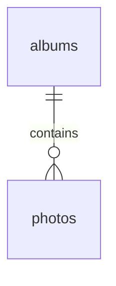

# Rule 1 - ERD 必須寫在 DDL.md，且只用 Mermaid erDiagram

- Level: `MUST`
- 關聯視覺化固定寫在 `DDL.md` 的 `## ERD`，使用 Mermaid `erDiagram` code fence。
- 不可在 `data-plan.md` 內嵌 ERD；也不可再用關聯表格重述同一份圖。
- 圖中應標出實體關鍵欄位與 PK／FK／UK 等必要標記，讓讀者能對上 `data-plan.md` 欄位表與本檔 DDL。

## Good Example

- 這個例子是好的，因為 ERD 在 DDL.md 且只用 Mermaid。

````md
## ERD


````

## Bad Example

- 這個例子是壞的，因為把 ERD 塞回 data-plan。

```md
# 資料計畫：…
## ERD
（mermaid…）
```

# Rule 2 - 關聯基數必須由業務規則決定，並落成可執行結構

- Level: `MUST`
- 1:1、1:N、M:N 必須依 spec／clarify 決策選擇；M:N 必須在 `data-plan.md` 有一級中介實體，並在 DDL 有對應表。
- 外鍵、級聯刪除、複合主鍵等完整性策略要能在 ERD、設計脈絡與 DDL 互相對得上。
- 不可在 ERD 寫 M:N，DDL 卻只用單向 FK 假裝完成。

## Good Example

- 這個例子是好的，因為基數與實作一致。

```md
ERD：albums ||--o{ album_photos }|--|| photos
設計脈絡：說明為何 M:N
DDL：album_photos PK (album_id, photo_id) + FK CASCADE
```

## Bad Example

- 這個例子是壞的，因為圖與表互相矛盾。

```md
ERD 標 M:N，但 photos 只有單一 album_id 欄位。
```

# Rule 3 - spec 禁止的結構不得在 ERD／DDL 預留

- Level: `MUST`
- 若 `spec.md`（或 clarify）已禁止某種持久化結構（例如巢狀階層、軟刪除欄位、多租戶鍵），ERD／實體／DDL 皆不得預留對應欄位或關聯「以後再用」。
- 禁止的跨實體邊應在「設計脈絡」說明；禁止的欄位不出現在實體表與 DDL。

## Good Example

- 這個例子是好的，因為用缺邊＋設計脈絡落實禁止巢狀。

```md
設計脈絡：因為相簿不可巢狀（FR-003），所以不建立父子邊、不提供 parent_album_id。
ERD／DDL：無 parent 關聯與欄位。
```

## Bad Example

- 這個例子是壞的，因為預留了被禁止的結構。

```md
albums.parent_album_id NULL -- 以後再做巢狀
```

# Rule 4 - DDL.md 必須有「設計脈絡」說明實體間為何這樣連

- Level: `MUST`
- 只要產出 `DDL.md`，ERD 下方必須有 `### 設計脈絡`。
- 設計脈絡只談實體之間的形狀：基數、有無中介表、刻意缺邊、歸屬／級聯方向；不重寫欄位級驗證（那些屬 `data-plan.md` 約束清單）。
- 採 `因為…，所以…` 因果句；有 FR／US 時括號緊接原因之後。
- 若本期無跨實體關聯，仍保留本節，並寫明「本期無跨實體關聯」之類極短宣告。

## Good Example

- 這個例子是好的，因為只解釋關聯形狀。

```md
### 設計脈絡

- 因為每張照片同一時間只屬一個相簿（spec 假設），所以 albums 與 photos 採 1:N，不設 M:N 中介表。
```

## Bad Example

- 這個例子是壞的，因為把 mime 白名單等欄位約束寫進設計脈絡。

```md
### 設計脈絡

- 因為只支援三種 MIME，所以 mime_type 做 CHECK。
```
