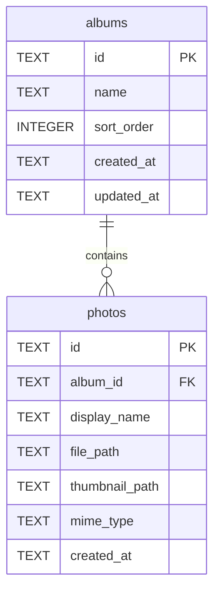

# DDL：照片相簿整理應用程式

**功能分支**: `001-photo-albums`
**建立日期**: 2026-07-22
**狀態**: 草稿
**對齊**: `system-analyze/data-plan.md`

## ERD



### 設計脈絡

- 因為每張照片同一時間只會屬於一個相簿（spec 假設），所以 `albums` 與 `photos` 採 1:N，不設 M:N 中介表。
- 因為相簿不可巢狀（GR-001），所以不建立相簿對相簿的父子邊，亦不提供 `parent_album_id`。
- 因為照片必須依附指定相簿存在（US1-FR2），所以刪除相簿時以 `ON DELETE CASCADE` 一併刪除所屬照片；反向刪光照片時不刪相簿（空相簿仍保留，見 data-plan 約束）。

---

## DDL

> 單一腳本、多表並以註解區隔。建表順序：`albums` → `photos`。

```sql
-- ========== albums ==========
CREATE TABLE albums (
  id TEXT PRIMARY KEY,
  name TEXT NOT NULL CHECK (trim(name) <> ''),
  sort_order INTEGER NOT NULL DEFAULT 0,
  created_at TEXT NOT NULL,
  updated_at TEXT NOT NULL
);

CREATE INDEX ix_albums_created_at_sort
  ON albums (created_at, sort_order);

-- ========== photos ==========
CREATE TABLE photos (
  id TEXT PRIMARY KEY,
  album_id TEXT NOT NULL,
  display_name TEXT NOT NULL CHECK (trim(display_name) <> ''),
  file_path TEXT NOT NULL,
  thumbnail_path TEXT,
  mime_type TEXT NOT NULL CHECK (mime_type IN ('image/jpeg', 'image/png', 'image/heic')),
  created_at TEXT NOT NULL,
  FOREIGN KEY (album_id) REFERENCES albums (id) ON DELETE CASCADE
);

CREATE INDEX ix_photos_album_id_created
  ON photos (album_id, created_at);
```

## 假設

- 第一版為單機個人應用，DDL 以本機 SQLite 語意撰寫
- 時間欄位以 `TEXT` 存 ISO-8601 字串，不另用引擎原生 datetime 型別
- 建表順序固定為 `albums` → `photos`，以滿足外鍵依賴
- `FOREIGN KEY`／級聯對齊上方「設計脈絡」；`CHECK`／必填／索引對齊 `data-plan.md` 約束清單中可落庫項；領域策略（如 `photo_count` 不落庫）不在本腳本建欄
