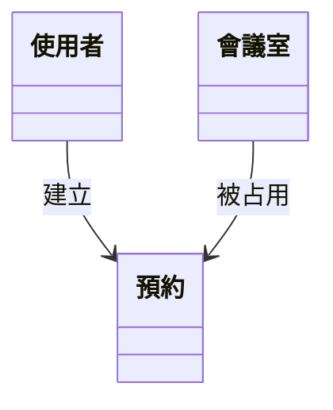
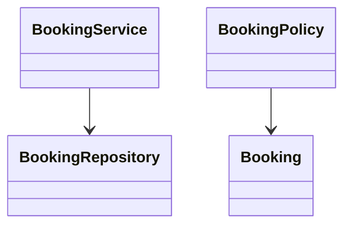
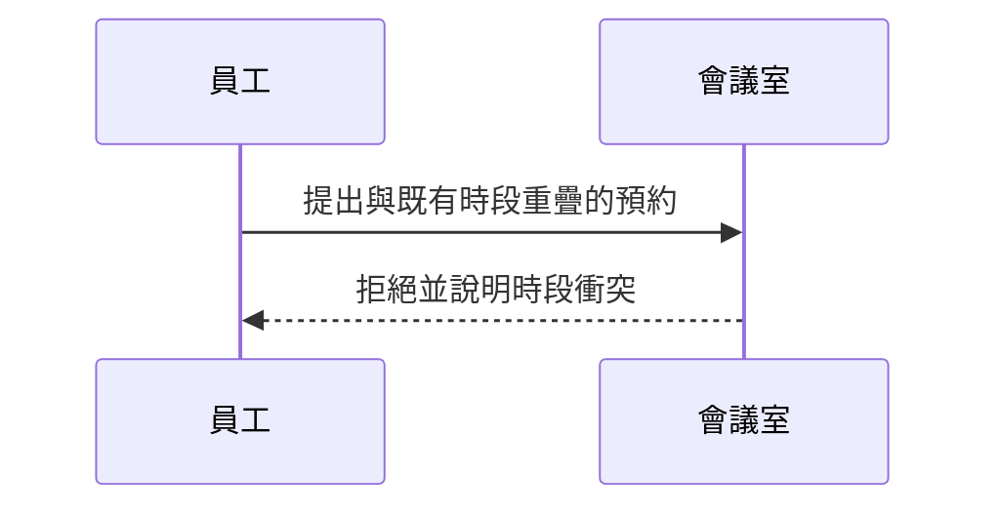
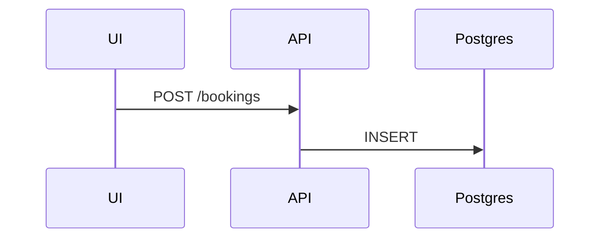

# Rule 1 - 四步順序固定為 Diagram → 敘述 → Class → Sequence

- Level: `MUST`
- 簡化循環星形法在本 skill 的落地順序固定為：(1) Use Case Diagram (2) Use Case 敘述 (3) 領域 Class Diagram (4) 業務 Sequence Diagram。
- 不可先寫敘述再補 Diagram 作為主產物順序；`ooa.md` 章節順序必須與上列一致。
- 四步皆完成後才寫檔末 `## 假設`（低風險項）；不可用假設章節取代任一分析步驟。

## Good Example

- 這個例子是好的，因為章節順序與方法論一致。

```md
## 1. Use Case Diagram
## 2. Use Case 敘述
## 3. 領域 Class Diagram
## 4. 業務 Sequence Diagram
## 6. 假設
```

## Bad Example

- 這個例子是壞的，因為先堆敘事再補圖，且跳過領域模型。

```md
## 1. Use Case 敘述
## 2. Sequence（含 API）
```

# Rule 2 - 敘述階層固定為 User Story → Use Case

- Level: `MUST`
- Use Case 敘述必須掛在對應的 User Story 底下：`### USx - …` 之下再 `#### UC-xx …`。
- 不可把全部 UC 攤成與 US 無關的平鋪清單，也不可倒置為 UC 包住 US。
- 每個 UC 敘述至少含：主要 Actor、前置條件、主成功情境、失敗／例外、事後條件（可加備註）。

## Good Example

- 這個例子是好的，因為 US 為單位、UC 為其下用例。

```md
### US1 - 登入後瀏覽會議室並完成單次預約
#### UC-01 登入
#### UC-02 瀏覽會議室
```

## Bad Example

- 這個例子是壞的，因為 UC 與 US 脫鉤平鋪。

```md
#### UC-01
#### UC-02
### 對應故事：可能是 US1 或 US2
```

# Rule 3 - Use Case Diagram 必須是正規 UML 語意

- Level: `MUST`
- Actor 在系統邊界外；Use Case 為橢圓（或工具等價）在邊界內；association 只連 Actor ↔ Use Case。
- 可用 Actor 繼承（空心三角）減少共用能力的重複連線；package／分組框若出現，僅視覺分組，**不可**當 association 端點。
- 不可用 Mermaid flowchart／emoji 人型冒充正式 Use Case Diagram 作為主交付；主圖以 PlantUML（或等價 UML 工具）＋匯出圖為準。

## Good Example

- 這個例子是好的，因為關聯端點正確且可用繼承降噪。

```plantuml
actor "員工" as Emp
actor "部門主管" as Mgr
Mgr --|> Emp
Emp --> (UC-01 登入)
```

## Bad Example

- 這個例子是壞的，因為把 Actor 連到 package。

```plantuml
Emp --> SharedPackage
```

# Rule 4 - 領域 Class 不混入解法物件

- Level: `MUST`
- 領域 Class Diagram 只表達業務可見的概念與關聯（如使用者、會議室、預約）。
- 不可安插 Service、Controller、Repository、Policy、DTO、ORM Entity 等解法／實作型別。
- 下游 `data-plan` 可對齊此圖之實體名；本圖不寫欄位型別到 SQL／DDL 粒度。

## Good Example

- 這個例子是好的，因為只留領域概念。



## Bad Example

- 這個例子是壞的，因為混入實作分層。



# Rule 5 - Sequence 僅業務語言

- Level: `MUST`
- 業務 Sequence 的參與者限於 Actor 與領域物件（或業務可理解的抽象）；訊息用業務動詞。
- 不可出現 HTTP method、status code、SQL、框架元件、middleware、session store 等實作細節。
- Sequence 不必覆蓋每一 UC；應優先選能暴露規則／衝突／權限的關鍵路徑（含至少一條失敗或例外路徑為佳）。

## Good Example

- 這個例子是好的，因為衝突以業務語言表達。



## Bad Example

- 這個例子是壞的，因為混入 API／DB。


