# Rule 1 - 最終 ooa.md 必須寫到固定路徑

- Level: `MUST`
- `ooa-plan` 的最終主產物路徑固定為 `specs/<NNN-plan-package>/system-analyze/ooa.md`。
- 不可把完成稿只留在聊天訊息、暫存筆記或其他任意檔名中，否則後續系統分析與一致性檢查難以穩定接續。
- 若 `system-analyze/` 目錄尚不存在，應先建立該目錄再寫入 `ooa.md`。

## Good Example

- 這個例子是好的，因為輸出路徑與 skill 契約完全對齊。

```text
specs/002-meeting-room-booking/system-analyze/ooa.md
```

## Bad Example

- 這個例子是壞的，因為它把 OOA 放到臨時位置，其他流程無法穩定接手。

```text
tmp/ooa-draft.md
```

# Rule 2 - Use Case 附屬圖必須與 ooa.md 同目錄

- Level: `MUST`
- Use Case Diagram 的 PlantUML 源預設為同目錄 `ooa-use-case.puml`；供 Markdown Preview 閱讀的匯出圖預設為 `ooa-use-case.png`（若改名，`ooa.md` 內引用必須同步）。
- 附屬圖不可只存在於聊天附件而未寫入 package；亦不可改放到與 `ooa.md` 不同的 package。
- `ooa.md` §1 應嵌入相對路徑圖片（或明確註明待補圖檔），並可連結 `.puml` 來源。

## Good Example

- 這個例子是好的，因為主檔與附屬圖同層、可 Preview。

```text
specs/002-meeting-room-booking/system-analyze/ooa.md
specs/002-meeting-room-booking/system-analyze/ooa-use-case.puml
specs/002-meeting-room-booking/system-analyze/ooa-use-case.png
```

## Bad Example

- 這個例子是壞的，因為只貼 PlantUML 程式碼塊且 Preview 看不到圖，又無匯出檔。

```md
## 1. Use Case Diagram

```plantuml
@startuml
...
@enduml
```

```

# Rule 3 - `plan-package` 必須與上游 spec 目錄對齊

- Level: `MUST`
- `plan-package` 必須沿用同功能的 `specs/<NNN-plan-package>/` 目錄名，採 `NNN-` 三位數前綴加英文小寫 kebab-case slug。
- 若使用者已指定既有 package，應寫入該 package 的 `system-analyze/`，不可另開平行目錄。
- 若尚無 package，應先確認上游 `spec.md` 的 package，再建立對應的 `system-analyze/`。

## Good Example

- 這個例子是好的，因為 ooa 與 spec 落在同一 package。

```text
specs/002-meeting-room-booking/spec.md
specs/002-meeting-room-booking/system-analyze/ooa.md
```

## Bad Example

- 這個例子是壞的，因為 OOA 與 spec 分散在不同 package，追溯會斷開。

```text
specs/002-meeting-room-booking/spec.md
specs/003-ooa-only/system-analyze/ooa.md
```

# Rule 4 - 標題與小標必須對齊 sibling 契約

- Level: `MUST`
- H1 固定為 `# OOA 計畫：{{FEATURE_NAME}}`，功能中文名與同 package 的 `spec.md` 對齊。
- 小標固定三行、分行書寫：`**功能分支**:`、`**建立日期**:`、`**狀態**:`；其中功能分支值必須以 inline code 包住，且與所在 `plan-package` 相同。
- `**建立日期**:` 使用本次產出日期（`YYYY-MM-DD`）；`**狀態**:` 第一版預設 `草稿`。

## Good Example

- 這個例子是好的，因為標題與小標與其他 system-analyze 產物同構。

```md
# OOA 計畫：內部共享會議室預約系統

**功能分支**: `002-meeting-room-booking`
**建立日期**: 2026-07-30
**狀態**: 草稿
```

## Bad Example

- 這個例子是壞的，因為 metadata 與目錄脫節。

```md
# OOA
**功能**: meeting-v2 ｜ 來源：聊天
```

# Rule 5 - 上游 research／plan 齊全前不得寫成定案 OOA

- Level: `MUST`
- 執行本 skill 前，同 package 必須已有 `system-analyze/technical-research.md` 與 package 根目錄 `plan.md`。
- 缺任一檔時應停止並請上游補齊，不可用 OOA 偷跑技術選型或系統介面合約。
- C4 Context／Container 若需補充，應回寫 technical-research，不塞進 `ooa.md`。

## Good Example

- 這個例子是好的，因為輸入契約齊全才產出 OOA。

```text
已存在 technical-research.md + plan.md → 產出 ooa.md
```

## Bad Example

- 這個例子是壞的，因為在尚無 plan 時把堆疊決策寫進 OOA。

```md
## 假設
- 後端用 NestJS + Prisma（尚無 technical-research）
```
