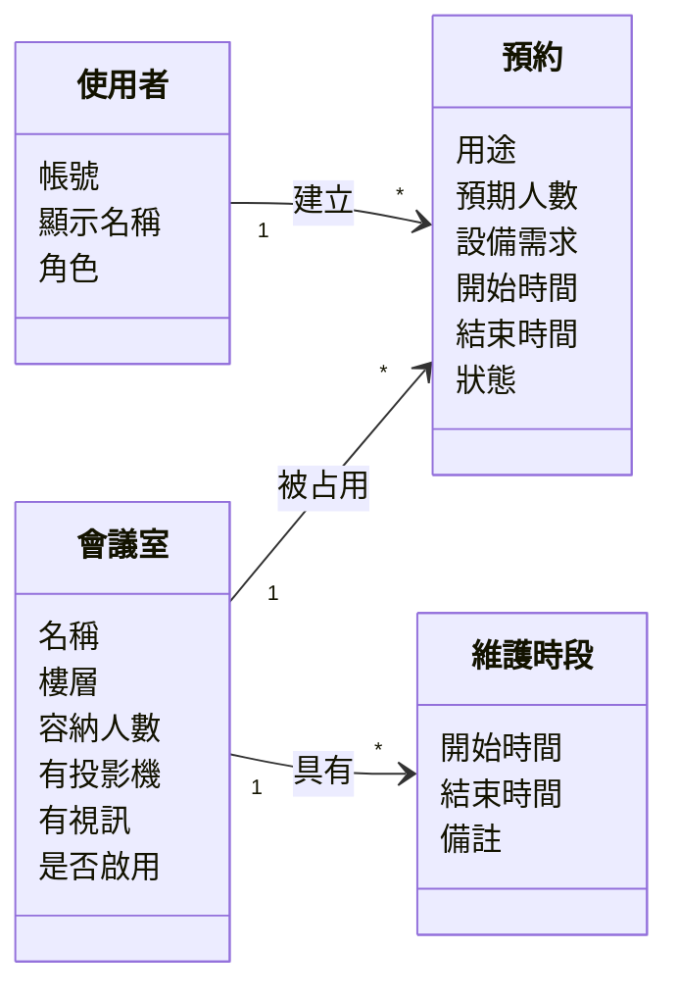
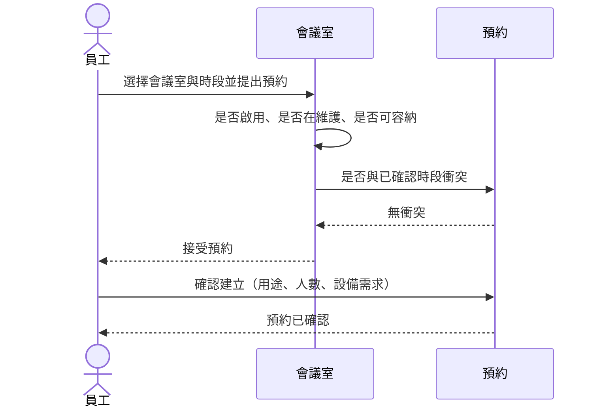
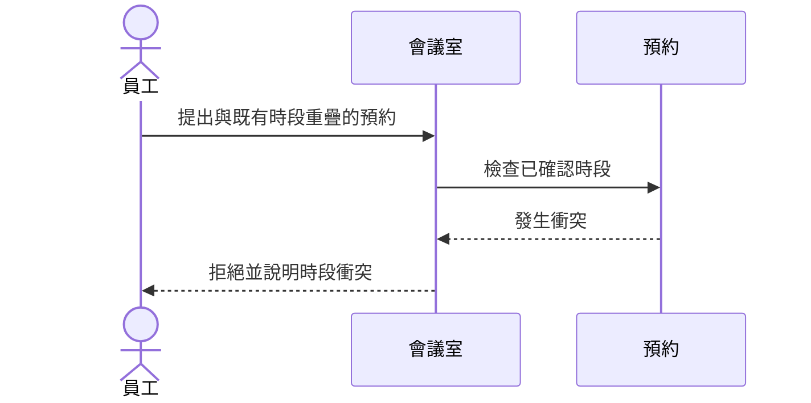
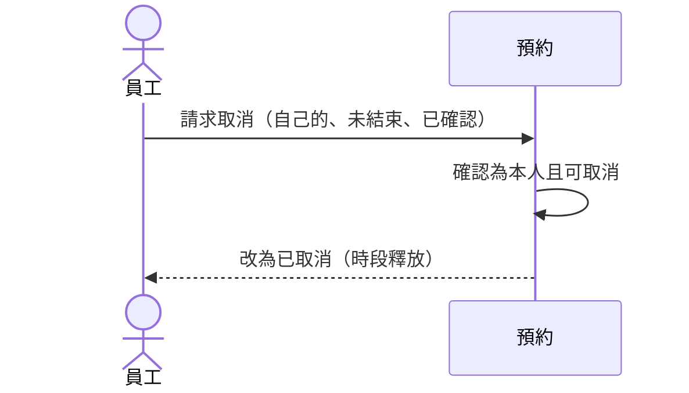
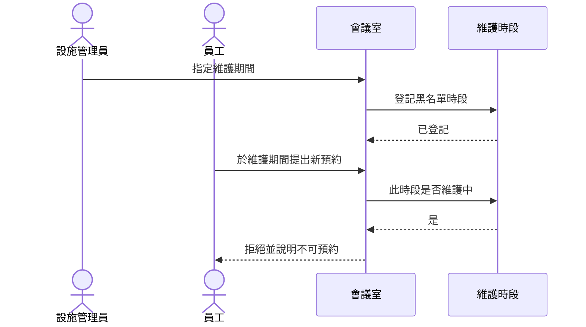

# OOA 計畫：內部共享會議室預約系統

**功能分支**: `002-meeting-room-booking`
**建立日期**: 2026-07-30
**狀態**: 定稿（本輪）

**敘述階層（定稿）**

```text
## User Story（單位）
  ### Use Case（該故事底下的用例描述）
```

---

## 1. Use Case Diagram

> 正式 UML（Actor／橢圓／系統邊界）。Preview 不渲染 PlantUML 原始碼，故嵌入已匯出圖；來源見同目錄 [`ooa-use-case.puml`](./ooa-use-case.puml)。


**設計備註**

- **正規語意**：association 只連 Actor ↔ Use Case（橢圓）；圖中 package 僅視覺分組，**不是**關聯端點。
- **Actor 繼承**（空心三角）：`部門主管`、`設施管理員` 繼承 `員工`，故共用 UC 只從 `員工` 畫線一次；主管不必再重複連線。
- `設施管理員` 另連 UC-08～10（專屬，非繼承自動取得）。
- Actor 是**角色**，不是單一帳號。

---

## 2. Use Case 敘述

### US1 - 登入後瀏覽會議室並完成單次預約

#### UC-01 登入


| 項目       | 內容                                                   |
| -------- | ---------------------------------------------------- |
| 主要 Actor | 員工、部門主管、設施管理員                                        |
| 前置條件     | 系統中已有該帳號                                             |
| 主成功情境    | 1. Actor 提供帳號與密碼 2. 系統驗證成功 3. Actor 進入已登入狀態並可依角色使用功能 |
| 失敗／例外    | 資料不完整；帳密錯誤（不暗示帳號是否存在）                                |
| 事後條件     | Actor 處於已登入狀態                                        |


#### UC-02 瀏覽會議室


| 項目       | 內容                                                |
| -------- | ------------------------------------------------- |
| 主要 Actor | 已登入使用者（含設施管理員）                                    |
| 前置條件     | Actor 已登入                                         |
| 主成功情境    | 1. Actor 請求會議室清單 2. 系統列出名稱、樓層、容納、設備、是否可新約（含停用可辨識） |
| 失敗／例外    | 未登入                                               |
| 事後條件     | Actor 可據清單選擇會議室                                   |
| 備註       | 亦服務 US4（管理員需看到新増／停用結果）                            |


#### UC-03 建立單次預約


| 項目       | 內容                                                                                  |
| -------- | ----------------------------------------------------------------------------------- |
| 主要 Actor | 員工、部門主管（設施管理員亦可作為一般預約者）                                                             |
| 前置條件     | Actor 已登入；目標會議室存在                                                                   |
| 主成功情境    | 1. 選擇會議室與時段，填用途、預期人數、設備需求 2. 系統依營業／容量／衝突／維護／啟用等業務規則檢查 3. 通過後建立「已確認」預約 4. Actor 得知成功 |
| 失敗／例外    | 未登入；欄位不合法；超容納；時段衝突；維護中；已停用；違反營業窗／時長／假日／跨日等                                          |
| 事後條件     | 成功則存在已確認預約；失敗則不新增已確認預約                                                              |


#### UC-11 登出


| 項目       | 內容                                       |
| -------- | ---------------------------------------- |
| 主要 Actor | 已登入使用者                                   |
| 前置條件     | Actor 已登入                                |
| 主成功情境    | 1. Actor 請求登出 2. 系統結束會話 3. Actor 回到未登入狀態 |
| 失敗／例外    | 本來未登入                                    |
| 事後條件     | Actor 未登入，受保護功能不可用                       |


---

### US2 - 以首頁、日曆與列表掌握會議室預約狀況

#### UC-04 檢視今日忙碌概況


| 項目       | 內容                                                |
| -------- | ------------------------------------------------- |
| 主要 Actor | 已登入使用者                                            |
| 前置條件     | Actor 已登入                                         |
| 主成功情境    | 1. Actor 開啟今日概況 2. 系統以 Asia/Taipei「今天」呈現各室相對忙碌／空閒 |
| 失敗／例外    | 未登入                                               |
| 事後條件     | Actor 能區分忙碌程度；無預約時為可理解之空閒／無預約態                    |


#### UC-05 以日曆或列表檢視預約


| 項目       | 內容                                         |
| -------- | ------------------------------------------ |
| 主要 Actor | 已登入使用者                                     |
| 前置條件     | Actor 已登入                                  |
| 主成功情境    | 1. Actor 選擇日曆或列表 2. 系統呈現同一批已確認預約的會議室、時段與摘要 |
| 失敗／例外    | 未登入                                        |
| 事後條件     | 無資料時顯示空狀態而非失敗                              |


---

### US3 - 查看並取消自己的預約

#### UC-06 查看我的預約


| 項目       | 內容                                       |
| -------- | ---------------------------------------- |
| 主要 Actor | 已登入使用者                                   |
| 前置條件     | Actor 已登入                                |
| 主成功情境    | 1. Actor 開啟「我的預約」 2. 系統列出自己的預約（含已確認／已取消） |
| 失敗／例外    | 未登入                                      |
| 事後條件     | 無預約時為可理解空狀態                              |


#### UC-07 取消自己的預約


| 項目       | 內容                                 |
| -------- | ---------------------------------- |
| 主要 Actor | 已登入之預約建立者                          |
| 前置條件     | 存在自己的、尚未結束的已確認預約                   |
| 主成功情境    | 1. 選定自己的預約 2. 請求取消 3. 系統改為已取消並釋放時段 |
| 失敗／例外    | 取消他人；已結束或已取消                       |
| 事後條件     | 該預約為已取消；時段可供他人再預約                  |


---

### US4 - 管理員維護會議室與不可預約時段

#### UC-08 新增會議室


| 項目       | 內容                                                 |
| -------- | -------------------------------------------------- |
| 主要 Actor | 設施管理員                                              |
| 前置條件     | 以設施管理員身分登入                                         |
| 主成功情境    | 1. 填名稱、樓層、容納、投影機／視訊 2. 系統建立啟用中會議室 3. 其他使用者之後可瀏覽／預約 |
| 失敗／例外    | 非管理員；欄位不合法                                         |
| 事後條件     | 新會議室存在且預設可新約                                       |


#### UC-09 停用會議室


| 項目       | 內容                                         |
| -------- | ------------------------------------------ |
| 主要 Actor | 設施管理員                                      |
| 前置條件     | 以設施管理員身分登入；目標會議室存在                         |
| 主成功情境    | 1. 將會議室標為停用 2. 之後不得新預約 3. 既有已確認預約不因停用而自動取消 |
| 失敗／例外    | 非管理員                                       |
| 事後條件     | 該室不可新約；既有已確認預約仍有效                          |


#### UC-10 設定維護黑名單時段


| 項目       | 內容                                      |
| -------- | --------------------------------------- |
| 主要 Actor | 設施管理員                                   |
| 前置條件     | 以設施管理員身分登入                              |
| 主成功情境    | 1. 指定會議室與維護起迄 2. 系統保存 3. 該時段內任何人新預約應被拒絕 |
| 失敗／例外    | 非管理員；起迄不合法                              |
| 事後條件     | 該室存在對應維護時段                              |


---

## 3. 領域 Class Diagram




**設計備註**

- 下游 `data-plan` 實體應對齊：使用者、會議室、預約、維護時段。
- 不在此圖安插 Service／Policy（偏解法／實作）。

---

## 4. 業務 Sequence Diagram

### 4.1 建立單次預約（成功）— US1／UC-03




### 4.2 建立預約（時段衝突）— US1／UC-03




### 4.3 取消自己的預約 — US3／UC-07




### 4.4 設定維護時段後阻擋新預約 — US4／UC-10 → US1／UC-03




---

## 6. 假設

- 敘述階層固定為 **US → UC**；Diagram 仍先於敘述完成。
- Use Case 圖以 PlantUML 表達標準 UML；Sequence／Class 仍用 Mermaid。
- Sequence 維持業務語言；實作分層留給 task／TDD。

