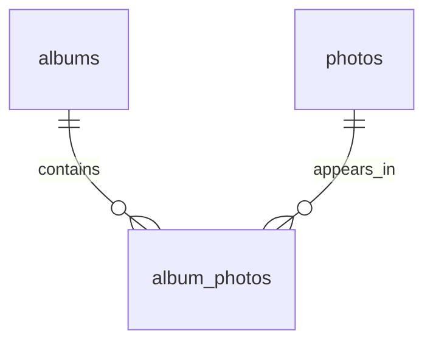

# Rule 1 - ERD 必須用 Mermaid erDiagram，不另附關聯表格

- Level: `MUST`
- 關聯視覺化固定使用 Mermaid `erDiagram` code fence。
- 不可再用「左側實體／關係／右側實體」這類 Markdown 表格重述同一份 ERD。
- 圖中應標出實體關鍵欄位與 PK／FK／UK 等必要標記，讓讀者能對上欄位表與 DDL。

## Good Example

- 這個例子是好的，因為只用 Mermaid 表達關聯。

````md

````

## Bad Example

- 這個例子是壞的，因為用表格重複畫一次關聯。

```md
| 左側實體 | 關係 | 右側實體 | 基數 |
| Album | 包含 | Photo | M:N |
```

# Rule 2 - 關聯基數必須由業務規則決定，並落成可執行結構

- Level: `MUST`
- 1:1、1:N、M:N 必須依 spec／clarify 決策選擇；M:N 必須有一級中介實體與對應表。
- 外鍵、級聯刪除、複合主鍵等完整性策略要能在 ERD 與 DDL 互相對得上。
- 不可在 ERD 寫 M:N，DDL 卻只用單向 FK 假裝完成。

## Good Example

- 這個例子是好的，因為基數與實作一致。

```md
ERD：albums ||--o{ album_photos }|--|| photos
DDL：album_photos PK (album_id, photo_id) + FK CASCADE
```

## Bad Example

- 這個例子是壞的，因為圖與表互相矛盾。

```md
ERD 標 M:N，但 photos 只有單一 album_id 欄位。
```

# Rule 3 - spec 禁止的結構不得在 ERD／DDL 預留

- Level: `MUST`
- 若 `spec.md`（或 clarify）已禁止某種持久化結構（例如巢狀階層、軟刪除欄位、多租戶鍵），ERD／實體／DDL 皆不得預留對應欄位或關聯「以後再用」。
- 禁止項應以結構落實為主，而不是只靠應用層註解提醒。

## Good Example

- 這個例子是好的，因為用結構落實「相簿不可巢狀」。

```md
spec：相簿絕不巢狀（FR-003）
設計：albums 無 parent_album_id；約束清單寫明因 FR-003 而不提供
```

## Bad Example

- 這個例子是壞的，因為預留了被禁止的結構。

```md
albums.parent_album_id NULL -- 以後再做巢狀
```
