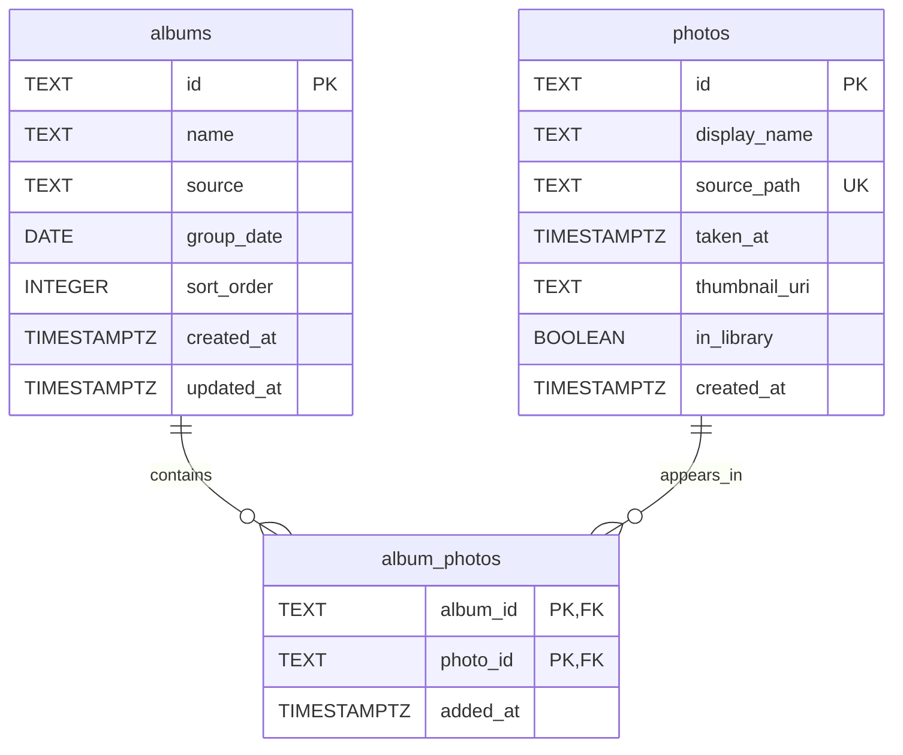

# 資料計畫：照片相簿整理

**功能分支**: `001-photo-albums`
**建立日期**: 2026-07-20
**狀態**: 草稿

## 實體：Album（相簿）

相簿是整理照片的容器。單層結構，可手動建立或依日期自動成冊；主頁依日期分組，並可拖放重排。

| 欄位 | 型別 | 必填 | 說明 | 驗證規則 | 對應 User Story |
| --- | --- | --- | --- | --- | --- |
| `id` | TEXT | 系統產生 | 相簿主鍵 | 主鍵，全域唯一 | — |
| `name` | TEXT | 是 | 相簿可辨識名稱；自動成冊時可為日期導向名稱 | 非空白 (FR-001, FR-014) | US-1, US-5 |
| `source` | TEXT | 是 | 建立來源：`manual` 或 `auto_date` | 限 `'manual'` / `'auto_date'` (FR-015) | US-1, US-5 |
| `group_date` | DATE | 是 | 主頁日期分組用的日期鍵 | 格式 `YYYY-MM-DD` (FR-008) | US-3, US-5 |
| `sort_order` | INTEGER | 是 | 主頁拖放後的自訂順序（同分組內） | 預設 `0` (FR-009, FR-010) | US-3 |
| `created_at` | TIMESTAMPTZ | 系統產生 | 建立時間 | 預設 now() | — |
| `updated_at` | TIMESTAMPTZ | 系統產生 | 最後更新時間 | 寫入／重排時更新 | — |

### 衍生屬性

- **`photo_count`（相簿內照片數）**：純查詢計算，`COUNT(album_photos)` WHERE `album_id = albums.id`。用於列表與空狀態判斷 (FR-007)。

### 範例資料輸出

```json
{
  "id": "alb_01HZX2K9M3Q8R7N6P5T4V3W2X1",
  "name": "旅行",
  "source": "manual",
  "group_date": "2026-07-11",
  "sort_order": 0,
  "created_at": "2026-07-11T09:00:00+08:00",
  "updated_at": "2026-07-20T15:30:00+08:00"
}
```

---

## 實體：Photo（照片）

本機照片的持久化紀錄，也是照片庫的列級來源。同一本機路徑只對應一筆；加入相簿或分配時重用既有列。

| 欄位 | 型別 | 必填 | 說明 | 驗證規則 | 對應 User Story |
| --- | --- | --- | --- | --- | --- |
| `id` | TEXT | 系統產生 | 照片主鍵 | 主鍵，全域唯一 | — |
| `display_name` | TEXT | 是 | 列表／平鋪可辨識名稱 | 非空白 (FR-006, FR-011) | US-2, US-4 |
| `source_path` | TEXT | 是 | 本機來源路徑 | 全域唯一 (FR-002, FR-011) | US-1, US-4 |
| `taken_at` | TIMESTAMPTZ | 否 | 照片日期；自動成冊依據 | 缺日期可為 null；自動成冊時略過 (FR-014, FR-016) | US-5 |
| `thumbnail_uri` | TEXT | 否 | 平鋪預覽用縮圖 URI | (FR-006) | US-2 |
| `in_library` | BOOLEAN | 是 | 是否出現在照片庫 | 預設 `true` (FR-011) | US-4 |
| `created_at` | TIMESTAMPTZ | 系統產生 | 匯入／建立時間 | 預設 now() | — |

### 範例資料輸出

```json
{
  "id": "pho_01HZX3A1B2C3D4E5F6G7H8J9K0",
  "display_name": "IMG_20260711_090015.jpg",
  "source_path": "/Users/demo/Pictures/IMG_20260711_090015.jpg",
  "taken_at": "2026-07-11T09:00:15+08:00",
  "thumbnail_uri": "local://thumbs/pho_01HZX3A1B2C3D4E5F6G7H8J9K0.jpg",
  "in_library": true,
  "created_at": "2026-07-20T14:00:00+08:00"
}
```

---

## 實體：AlbumPhoto（相簿照片歸屬）

相簿與照片的多對多歸屬。同一張照片可屬於多本相簿；同一本相簿內同一張照片不可重複。

| 欄位 | 型別 | 必填 | 說明 | 驗證規則 | 對應 User Story |
| --- | --- | --- | --- | --- | --- |
| `album_id` | TEXT | 是 | 所屬相簿 | 對應既有 `albums.id`；外鍵，刪除相簿時級聯刪除 (FR-002, FR-003, FR-012) | US-1, US-4 |
| `photo_id` | TEXT | 是 | 所屬照片 | 對應既有 `photos.id`；外鍵，刪除照片時級聯刪除 (FR-004, FR-013, FR-016) | US-1, US-2, US-4, US-5 |
| `added_at` | TIMESTAMPTZ | 系統產生 | 加入該相簿的時間 | 預設 now()；平鋪預覽可依此排序 (FR-005) | US-2 |

複合主鍵：`(album_id, photo_id)`（同一相簿內不重複）。

### 範例資料輸出

```json
{
  "album_id": "alb_01HZX2K9M3Q8R7N6P5T4V3W2X1",
  "photo_id": "pho_01HZX3A1B2C3D4E5F6G7H8J9K0",
  "added_at": "2026-07-20T14:05:00+08:00"
}
```

---

## ERD



---

## 約束清單

- 因為相簿不可巢狀（FR-003），所以 `albums` 不提供 `parent_album_id`（或同等父相簿欄位）。
- 因為相簿必須可辨識（FR-001），所以 `albums.name` 必填且非空白。
- 因為手動建立與自動成冊要並存（FR-014, FR-015），所以 `albums.source` 限 `'manual'` / `'auto_date'`。
- 因為主頁要依日期分組（FR-008），所以 `albums.group_date` 必填且格式為 `YYYY-MM-DD`。
- 因為拖放順序重開主頁後仍要保留（FR-009, FR-010），所以 `albums.sort_order` 必填並持久化。
- 因為同一日不應產生多本自動相簿（FR-014），所以同一 `source = 'auto_date'` 且同一 `group_date` 至多一本。
- 因為同一本機檔不應重複建檔（US-1, US-4），所以 `photos.source_path` 全域唯一，加入／分配時重用既有列。
- 因為要支撐照片庫清單（FR-011），所以 `photos.in_library` 預設 `true`。
- 因為同一相簿內同一照片不可重複（FR-004），所以 `album_photos` 以 `(album_id, photo_id)` 為主鍵。
- 因為歸屬列不可懸空，所以 `album_photos.album_id` / `photo_id` 設外鍵並 `ON DELETE CASCADE`。
- 因為計數不可與歸屬列不一致（FR-007），所以 `photo_count` 不落庫，改由 `album_photos` 計數。
- 因為缺日期不應阻斷匯入（US-5），所以 `photos.taken_at` 可為 null；自動成冊時略過無日期照片。

---

## DDL

> 單一腳本、多表並以註解區隔。建表順序：`albums` / `photos` → `album_photos`。

```sql
-- ========== albums ==========
CREATE TABLE albums (
  id TEXT PRIMARY KEY,
  name TEXT NOT NULL,
  source TEXT NOT NULL CHECK (source IN ('manual', 'auto_date')),
  group_date TEXT NOT NULL,
  sort_order INTEGER NOT NULL DEFAULT 0,
  created_at TEXT NOT NULL,
  updated_at TEXT NOT NULL
);

CREATE UNIQUE INDEX ux_albums_auto_date_group
  ON albums (group_date)
  WHERE source = 'auto_date';

CREATE INDEX ix_albums_group_date_sort
  ON albums (group_date, sort_order);

-- ========== photos ==========
CREATE TABLE photos (
  id TEXT PRIMARY KEY,
  display_name TEXT NOT NULL,
  source_path TEXT NOT NULL,
  taken_at TEXT,
  thumbnail_uri TEXT,
  in_library INTEGER NOT NULL DEFAULT 1 CHECK (in_library IN (0, 1)),
  created_at TEXT NOT NULL
);

CREATE UNIQUE INDEX ux_photos_source_path
  ON photos (source_path);

CREATE INDEX ix_photos_in_library
  ON photos (in_library)
  WHERE in_library = 1;

CREATE INDEX ix_photos_taken_at
  ON photos (taken_at);

-- ========== album_photos ==========
CREATE TABLE album_photos (
  album_id TEXT NOT NULL,
  photo_id TEXT NOT NULL,
  added_at TEXT NOT NULL,
  PRIMARY KEY (album_id, photo_id),
  FOREIGN KEY (album_id) REFERENCES albums (id) ON DELETE CASCADE,
  FOREIGN KEY (photo_id) REFERENCES photos (id) ON DELETE CASCADE
);

CREATE INDEX ix_album_photos_photo_id
  ON album_photos (photo_id);

CREATE INDEX ix_album_photos_album_added
  ON album_photos (album_id, added_at);
```

## 假設

- 第一版為單機個人應用，資料保存在本機；DDL 以本機關聯式儲存（SQLite 語意）撰寫
- 相簿為單層結構，絕不巢狀；不提供 `parent_album_id` 或同等父相簿欄位
- 同一張照片可同時存在於多個相簿（M:N，以 `album_photos` 實作）
- 主頁先依 `group_date` 分組，組內依 `sort_order` 排列；拖放只持久化 `sort_order`
- 自動成冊以「日」為粒度；同一 `auto_date` + `group_date` 至多一本自動相簿
- 分配到相簿後，照片仍留在照片庫（`in_library` 預設且維持 `true`），可再分配
- 平鋪預覽排序固定依 `album_photos.added_at`（再以 `photo_id` 破平手）；不另存可調欄數／排序偏好
- `photo_count` 不落庫，由 `album_photos` 計數
- 主頁拖放與日期分組的精確共存規則、一張照片是否可屬多個相簿、自動成冊粒度、平鋪是否可調欄數／排序，若後續澄清與上述假設不符，需回寫本檔
