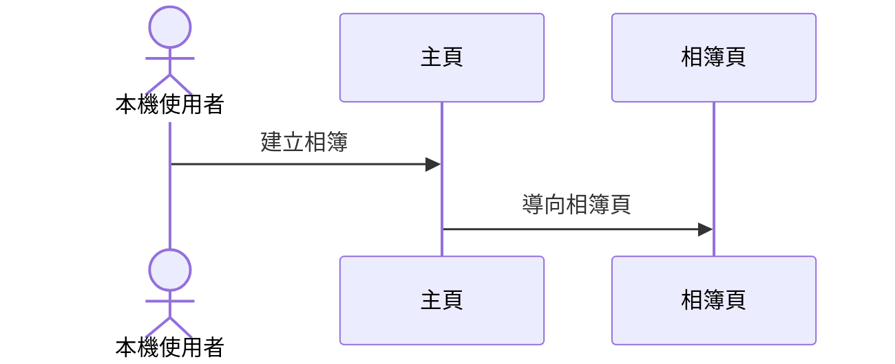
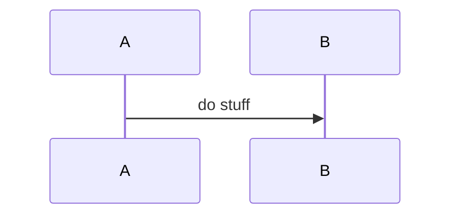

# Rule 1 - 業務邏輯必須依跨頁路徑切分並連續編號

- Level: `MUST`
- 每個業務邏輯區塊標題必須使用 `## 業務邏輯 N：標題`，`N` 從 1 起連續遞增、不跳號。
- 切分單位是跨頁業務路徑（依業務邏輯），不是一頁一條、也不是強制一 US 一條。
- 同一條業務邏輯只畫跨頁 Sequence；頁內操作細節留給各頁「操作 Flow」，避免兩層重疊。

## Good Example

- 這個例子是好的，因為編號連續，且每條對應一條跨頁路徑。

```md
## 業務邏輯 1：手動建立相簿並加入照片
## 業務邏輯 2：相簿內平鋪預覽
## 業務邏輯 3：主頁依日期分組與拖放重排
```

## Bad Example

- 這個例子是壞的，因為未編號，且把頁內細節塞進上層業務圖。

```md
## 業務邏輯：主頁
（圖裡把拖放、Modal 欄位校驗、縮圖載入全畫完）
```

# Rule 2 - 每條業務邏輯必須含簡介、跨頁 Sequence、對應追溯

- Level: `MUST`
- 每條業務邏輯固定順序：標題 → 一段簡介 → Mermaid `sequenceDiagram`（跨頁）→「對應：」條列。
- 對應條列必須能追溯到相關的 US、FR、AC（可用 `US-x`／`FR-xxx`／`AC-x-y`）；不可只有圖沒有追溯。
- Sequence 參與者應使用頁面與 API（或系統）角色，反映跨頁路徑。

## Good Example

- 這個例子是好的，因為結構完整且可追溯。

````md
## 業務邏輯 1：手動建立相簿並加入照片

本機使用者從主頁建立相簿，進入相簿後加入照片並確認結果。



對應：

- **US-1** …
- **FR-001** …
- **AC-1-1** …
````

## Bad Example

- 這個例子是壞的，因為缺簡介與追溯，只剩一張圖。

````md
## 業務邏輯 1：建立


````

# Rule 3 - 業務邏輯應覆蓋本期主要 US，但允許一條對多個 US

- Level: `SHOULD`
- 本期 `spec.md` 的主要 US 應至少出現在一條業務邏輯的對應條列中，避免整條價值路徑漏畫。
- 允許一條業務邏輯對應多個 US／FR／AC；也允許同一 US 的入口與驗證端分散在不同頁面職責中。
- 不應為了「一 US 一圖」而複製幾乎相同的跨頁 Sequence。

## Good Example

- 這個例子是好的，因為 US 有覆蓋，且沒有為湊數重複畫圖。

```md
業務邏輯 1 對應 US-1
業務邏輯 3 對應 US-3
主頁職責同時標 US-1（入口）、US-5（入口）
```

## Bad Example

- 這個例子是壞的，因為漏掉整條 US，或複製五張幾乎一樣的圖。

```md
只畫了主頁瀏覽，US-4 照片庫路徑完全沒有業務邏輯。
```
