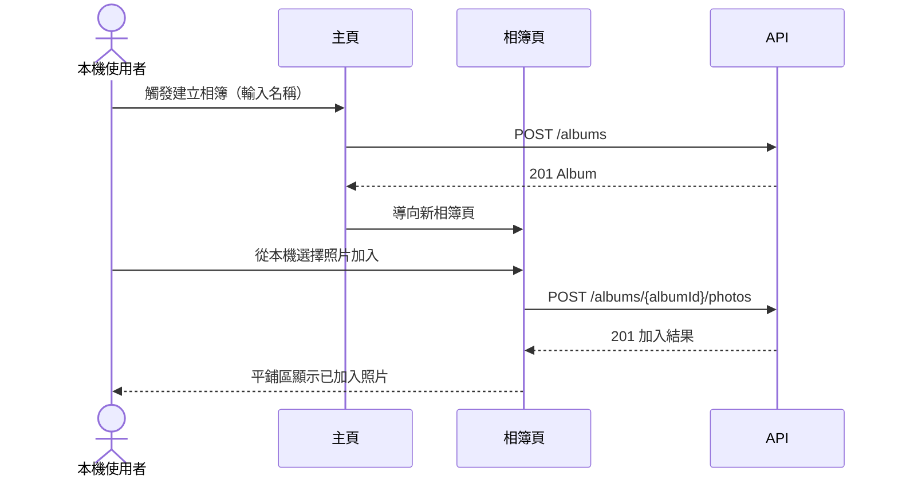
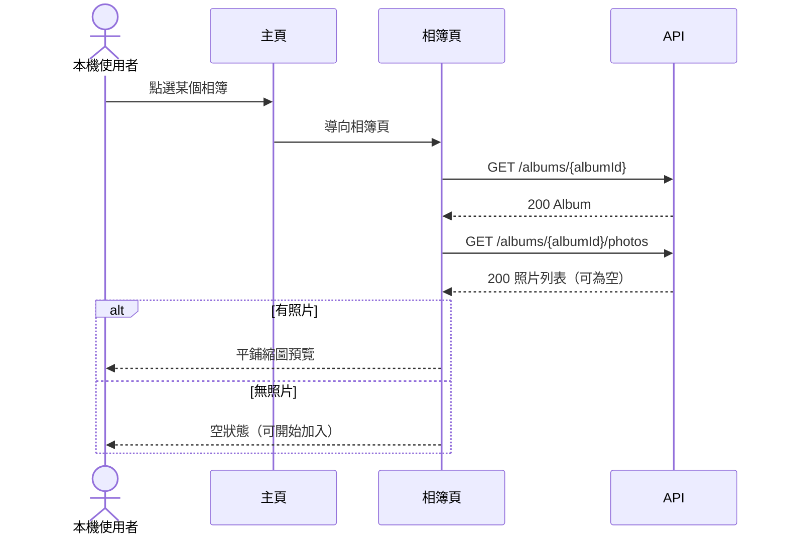
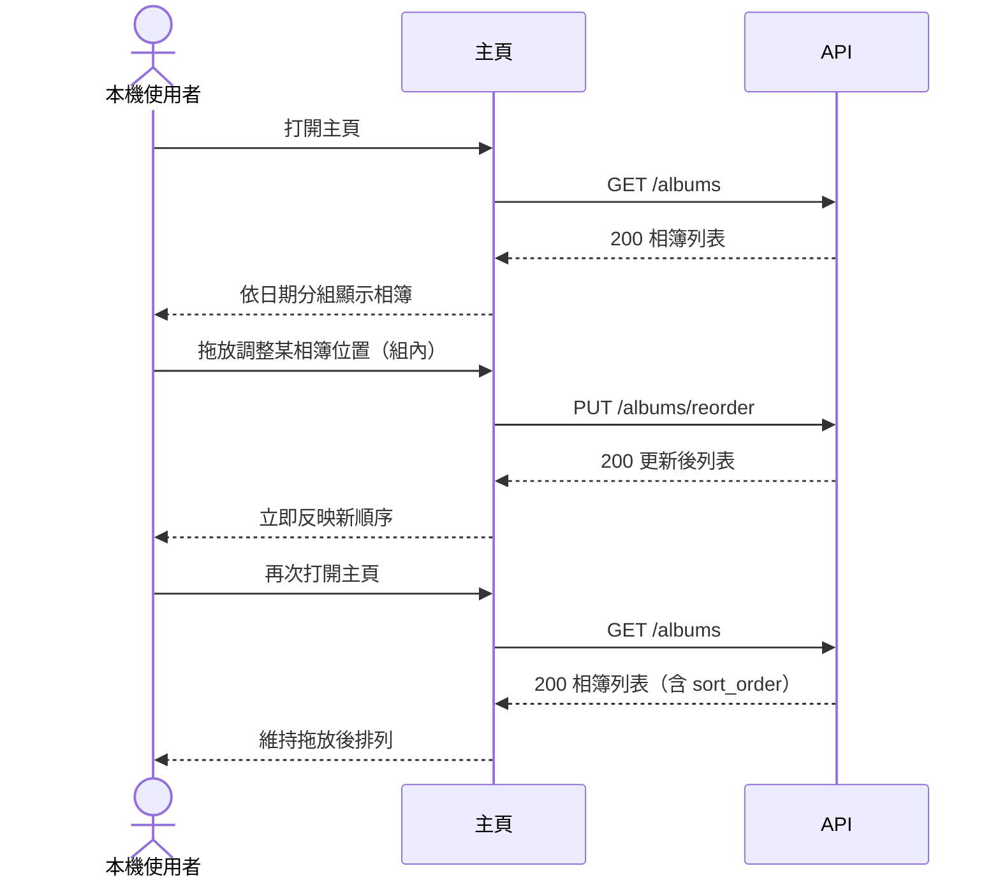
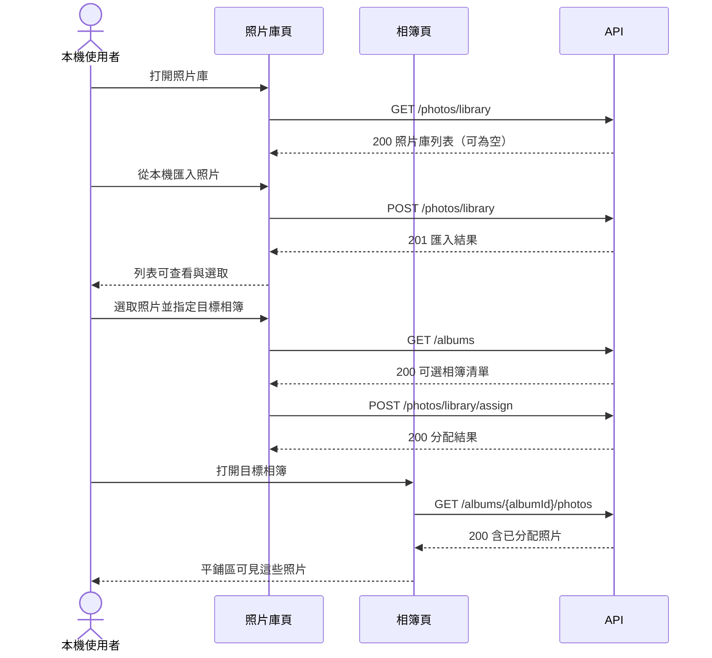
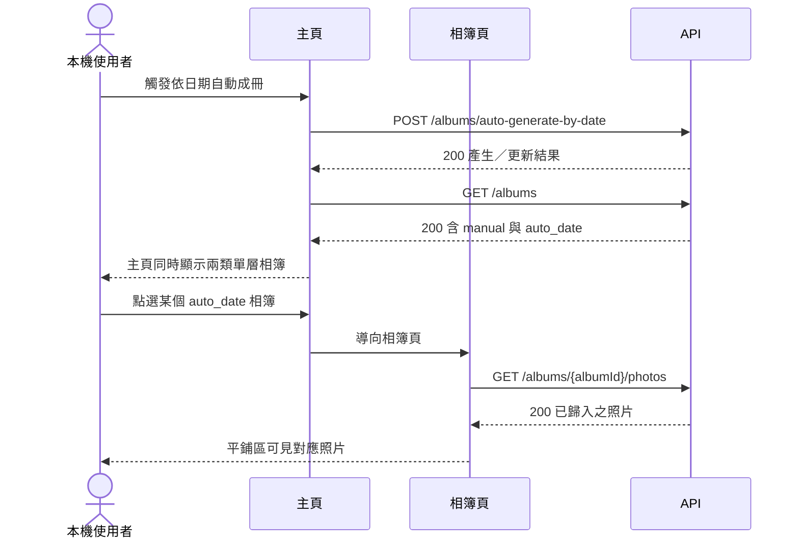
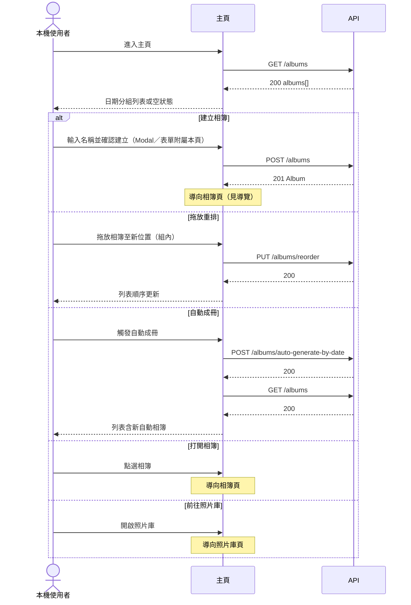
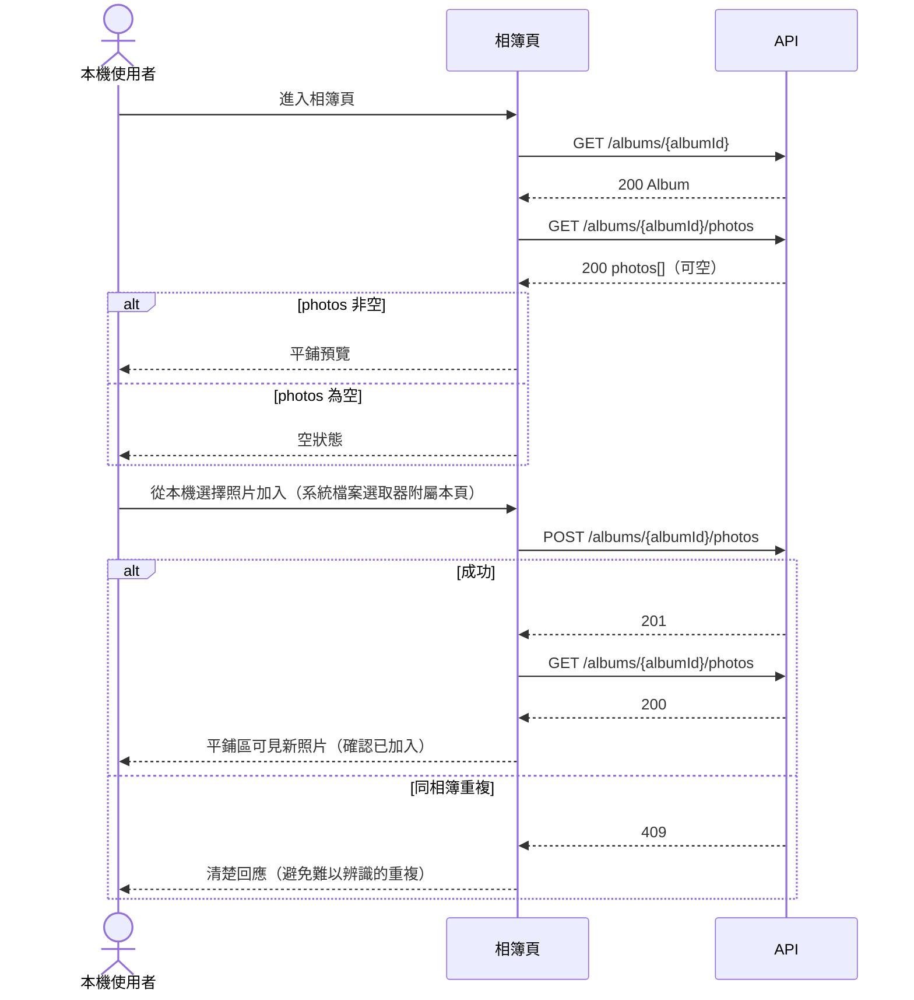
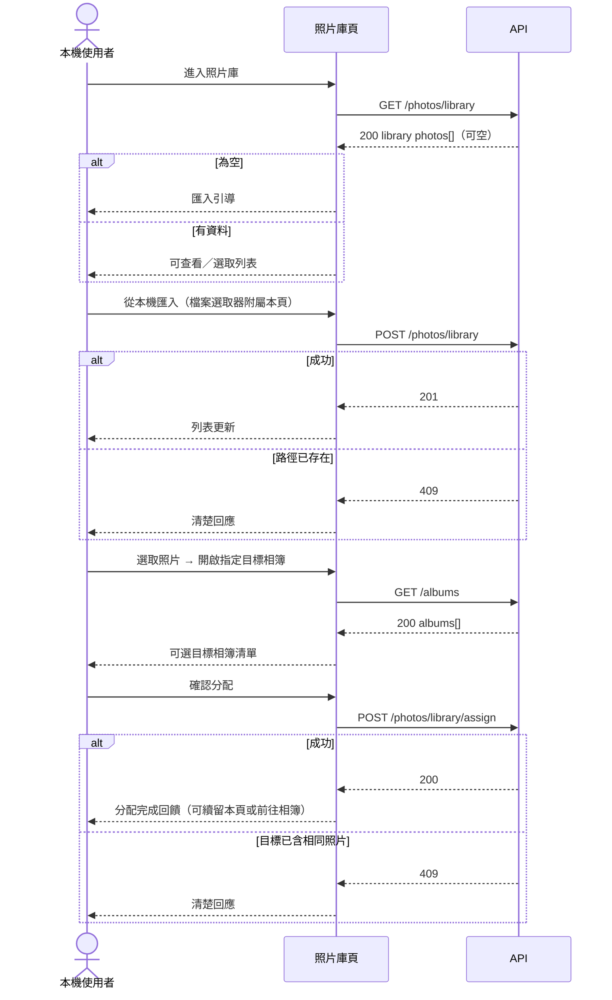
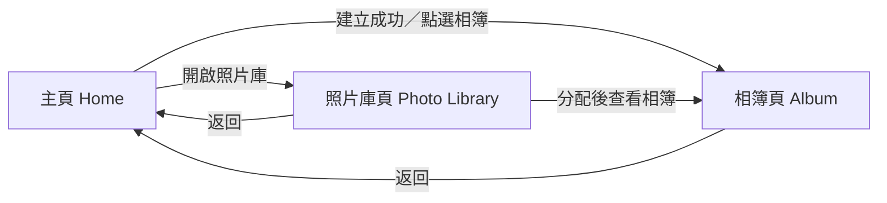

# UI 計畫：照片相簿整理

**功能分支**: `001-photo-albums`
**建立日期**: 2026-07-20
**狀態**: 草稿

## 業務邏輯 1：手動建立相簿並加入照片

本機使用者從主頁建立單層相簿，進入相簿後從本機選檔加入，並在相簿內確認照片已進入。此為第一版核心整理路徑。

對應：

- **US-1** 手動建立相簿並在相簿內加入照片
- **FR-001** 建立相簿並指定可辨識名稱
- **FR-002** 進入相簿後從本機加入照片
- **FR-003** 相簿僅單層、不可巢狀
- **FR-004** 加入後可確認照片已在相簿內
- **AC-1-1** 建立「旅行」並加入一張照片後，相簿存在且內含該照片
- **AC-1-2** 嘗試建立子相簿或把相簿拖進相簿時，系統拒絕並維持單層

---

## 業務邏輯 2：相簿內平鋪預覽

使用者打開既有相簿，以平鋪縮圖確認整理結果；無照片時顯示可加入的空狀態。

對應：

- **US-2** 以平鋪介面預覽相簿內照片
- **FR-005** 可打開任一相簿查看照片
- **FR-006** 以平鋪介面呈現多張縮圖
- **FR-007** 無照片時顯示空狀態
- **AC-2-1** 有多張照片的相簿打開後顯示平鋪縮圖
- **AC-2-2** 空相簿打開後顯示空狀態並提示可加入

---

## 業務邏輯 3：主頁依日期分組與拖放重排

使用者在主頁依日期分組查看相簿，並以拖放調整同分組內順序；重開主頁後順序仍保留。第一版假設：先依 `group_date` 分組，組內依 `sort_order` 排列。

對應：

- **US-3** 在主頁依日期分組查看並拖放重排相簿
- **FR-008** 主頁列出相簿並依日期分組
- **FR-009** 可拖放重排
- **FR-010** 重開主頁後維持排列
- **AC-3-1** 多個有日期資訊的相簿在主頁依日期分組顯示
- **AC-3-2** 拖放後再次打開主頁，仍呈現拖放後結果（組內自訂序）

---

## 業務邏輯 4：從照片庫分配到相簿

使用者先將本機照片匯入照片庫，再選取照片分配到既有相簿；完成後可在目標相簿看到照片。第一版假設：分配後照片仍留在照片庫，可再分配到其他相簿。

對應：

- **US-4** 從照片庫將照片分配到相簿
- **FR-011** 提供照片庫可匯入與查看
- **FR-012** 可從照片庫選取並分配到指定相簿
- **FR-013** 分配後在目標相簿可見
- **AC-4-1** 匯入後照片可在照片庫查看與選取
- **AC-4-2** 分配到既有相簿後，打開該相簿可見這些照片

---

## 業務邏輯 5：依日期自動產生相簿

使用者觸發依日期自動成冊；系統依照片 `taken_at` 以「日」為粒度產生 `auto_date` 相簿並歸入照片，與手動相簿並存在主頁且皆為單層。缺日期照片略過、不阻斷流程。

對應：

- **US-5** 依日期自動產生相簿
- **FR-014** 可依照片日期自動產生相簿
- **FR-015** 自動相簿與手動相簿一樣可在主頁查看且不可巢狀
- **FR-016** 有可用日期的照片歸入對應自動日期相簿
- **AC-5-1** 新增多張有日期照片並執行自動成冊後，出現對應日期相簿且照片可在其中找到
- **AC-5-2** 手動與自動相簿可同時存在於主頁，且皆維持單層

---

## 頁面：主頁（Home）

### 職責

- **US-3**：依日期分組查看相簿、拖放重排
- **US-1**（入口）：建立新相簿
- **US-5**（入口）：觸發依日期自動成冊
- **FR-001, FR-003, FR-008, FR-009, FR-010, FR-014, FR-015**

### 呈現內容

- 依 `group_date` 分組的相簿列表；每組顯示日期標題
- 每個相簿項目：`name`、`source`（手動／自動）、`photo_count`（可選顯示）
- 同分組內依 `sort_order` 排列
- 無相簿時：清楚空狀態（可建立相簿或自動成冊），不造成混淆
- 僅一個相簿時：仍正常列出，不隱藏拖放能力（拖放可不產生可視變化）

### 操作 Flow

結構性禁止巢狀：主頁不提供「把相簿拖進另一相簿」的有效投放目標；若使用者嘗試，系統拒絕且維持單層（FR-003）。

### 導覽

| 操作 | 前往頁面 |
| --- | --- |
| 建立相簿成功 | 相簿頁（新建立的 album） |
| 點選某個相簿 | 相簿頁 |
| 開啟照片庫 | 照片庫頁 |
| 拖放重排／自動成冊 | 留在主頁 |

### API 對應

| 使用者操作 | API | 說明 |
| --- | --- | --- |
| 載入主頁相簿列表 | `GET /albums` | 依日期分組與組內順序呈現 |
| 建立相簿 | `POST /albums` | 名稱必填；`source=manual` |
| 拖放重排 | `PUT /albums/reorder` | 持久化組內 `sort_order` |
| 依日期自動成冊 | `POST /albums/auto-generate-by-date` | 以日為粒度；缺日期略過 |

---

## 頁面：相簿頁（Album）

### 職責

- **US-1**：在相簿內從本機加入照片並確認結果
- **US-2**：平鋪預覽與空狀態
- **US-4**（驗證端）：確認從照片庫分配進來的照片可見
- **US-5**（驗證端）：確認自動成冊後照片可在對應相簿找到
- **FR-002, FR-003, FR-004, FR-005, FR-006, FR-007, FR-013, FR-016**

### 呈現內容

- 相簿標題：`name`（可附 `source`）
- 有照片：平鋪縮圖網格；項目含 `thumbnail_uri`／`display_name`
- 無照片：空狀態，提示可加入本機照片
- 第一版平鋪欄數／排序固定，不提供設定 UI（對齊 api-plan 假設）
- 不提供「在此相簿下建立子相簿」入口

### 操作 Flow

### 導覽

| 操作 | 前往頁面 |
| --- | --- |
| 返回 | 主頁 |
| 加入照片完成 | 留在相簿頁 |
| 嘗試建立子相簿／投放其他相簿 | 留在相簿頁（操作被拒絕）

### API 對應

| 使用者操作 | API | 說明 |
| --- | --- | --- |
| 載入相簿資訊 | `GET /albums/{albumId}` | 標題列 |
| 載入平鋪照片 | `GET /albums/{albumId}/photos` | 有資料／空狀態判斷 |
| 從本機加入照片 | `POST /albums/{albumId}/photos` | 選檔後寫入歸屬；重複則 409 |

---

## 頁面：照片庫頁（Photo Library）

### 職責

- **US-4**：匯入本機照片到照片庫、選取並分配到指定相簿
- **FR-011, FR-012, FR-013**

### 呈現內容

- 照片庫列表／網格：`display_name`、`thumbnail_uri`（可選 `taken_at`）
- 空庫：匯入引導
- 多選狀態：已選張數
- 分配目標：既有相簿清單，來自 `GET /albums`（可沿用主頁快取，過期或進入分配時重抓；選目標 UI 附屬本頁，非獨立頁）
- 分配後照片仍顯示於庫中（可再分配；對齊本檔假設）

### 操作 Flow

### 導覽

| 操作 | 前往頁面 |
| --- | --- |
| 返回 | 主頁 |
| 匯入完成 | 留在照片庫頁 |
| 分配完成後選擇查看相簿 | 相簿頁（目標 album） |
| 分配完成後繼續整理 | 留在照片庫頁 |

### API 對應

| 使用者操作 | API | 說明 |
| --- | --- | --- |
| 載入照片庫 | `GET /photos/library` | 空則顯示匯入引導 |
| 匯入本機照片 | `POST /photos/library` | 寫入庫列；路徑重複 409 |
| 載入分配目標相簿清單 | `GET /albums` | 供選目標；可沿用主頁快取 |
| 分配到相簿 | `POST /photos/library/assign` | 建立歸屬；目標已含則 409 |

---

## 頁面總覽（導覽關係）

| 頁面 | 主要 US |
| --- | --- |
| 主頁 | US-3；入口承載 US-1、US-5 |
| 相簿頁 | US-1、US-2；驗證 US-4／US-5 結果 |
| 照片庫頁 | US-4 |

---

## 假設

- 第一版為單機個人應用，資料保存在本機，不處理登入、雲端同步、跨裝置或多人共享
- 相簿為單層結構，絕不巢狀；UI 不提供建立子相簿或把相簿投放進另一相簿的有效入口
- 同一張照片允許同時存在於多個相簿；從照片庫分配後，該照片仍留在庫中且可再分配到其他相簿
- 主頁「依日期分組」與拖放重排共存方式：先依 `group_date` 分組，組內以 `sort_order` 呈現自訂順序
- 自動成冊以「日」為粒度；缺日期照片略過、不阻斷流程；自動相簿與手動相簿並存於主頁
- 相簿頁平鋪預覽欄數與排序第一版固定，不提供設定 UI
- 僅可獨立到達的全頁算頁面（主頁、相簿頁、照片庫頁）；Modal、本機檔案選取器、分配目標選擇等附屬寫入所屬頁操作 Flow
- 主頁拖放重排與日期分組的精確共存規則、一張照片是否可屬多個相簿、自動成冊粒度、平鋪是否可調欄數／排序，以及分配後照片庫呈現規則，若與 `spec.md` 後續澄清不一致，需回寫本檔
