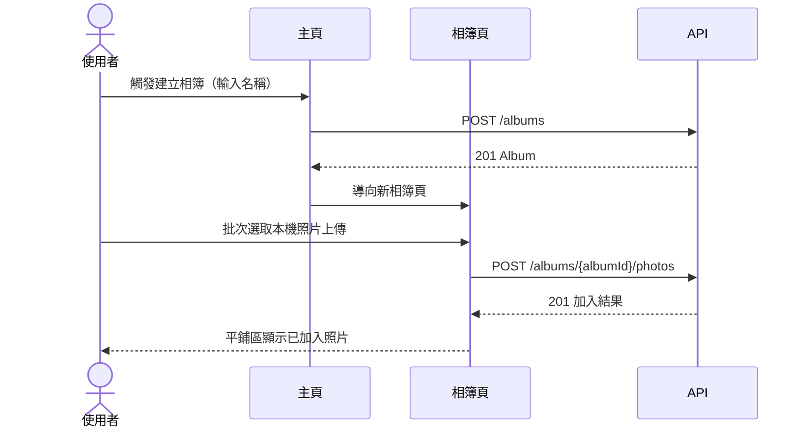
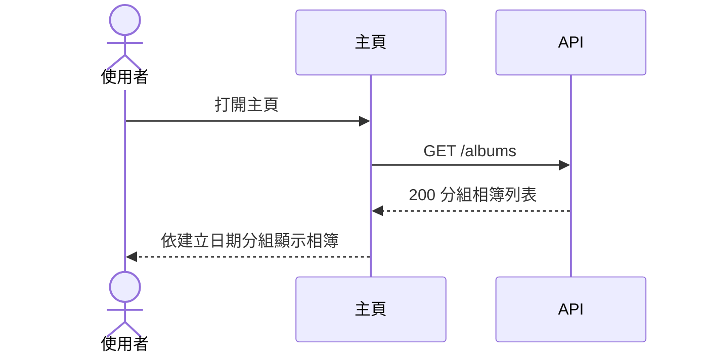
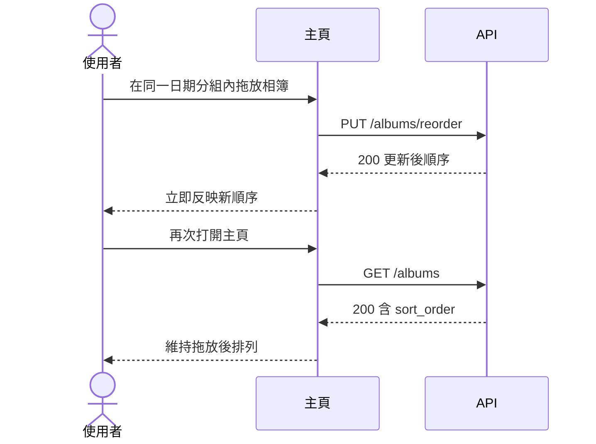
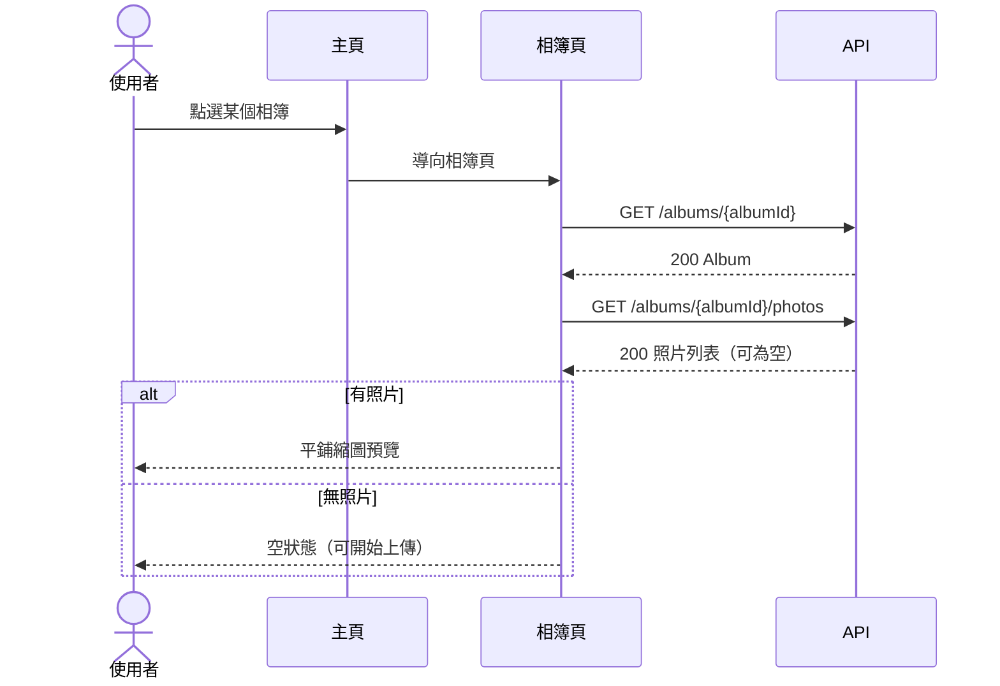
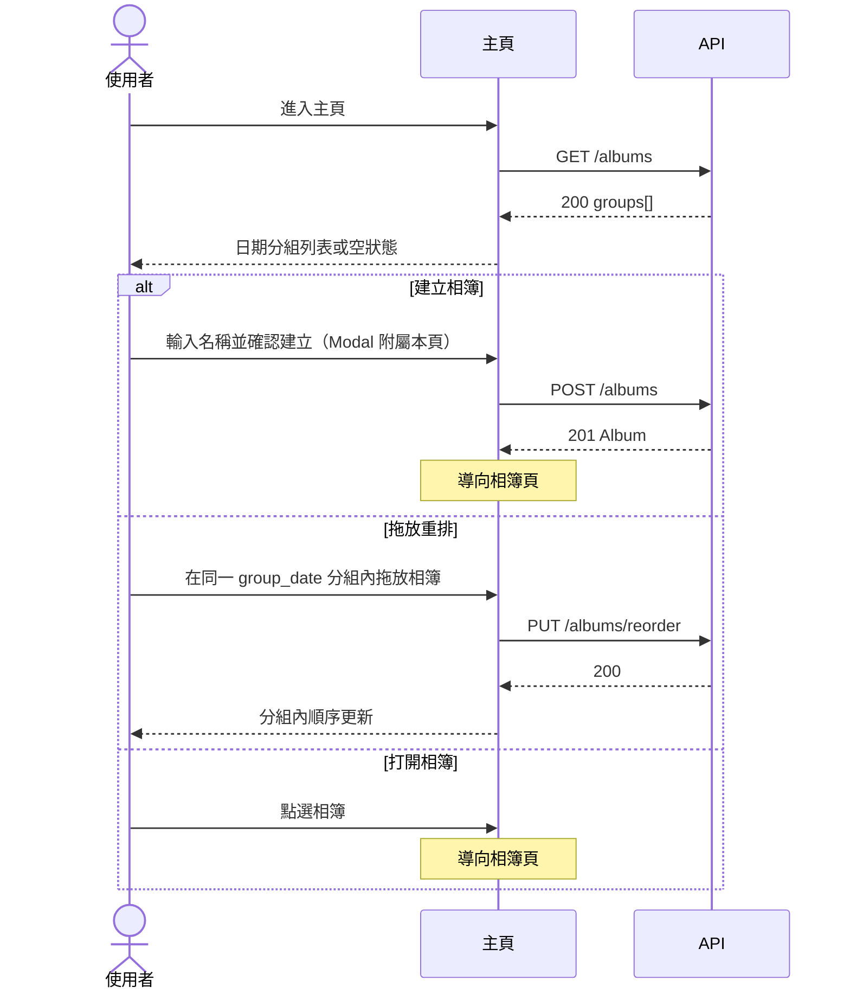
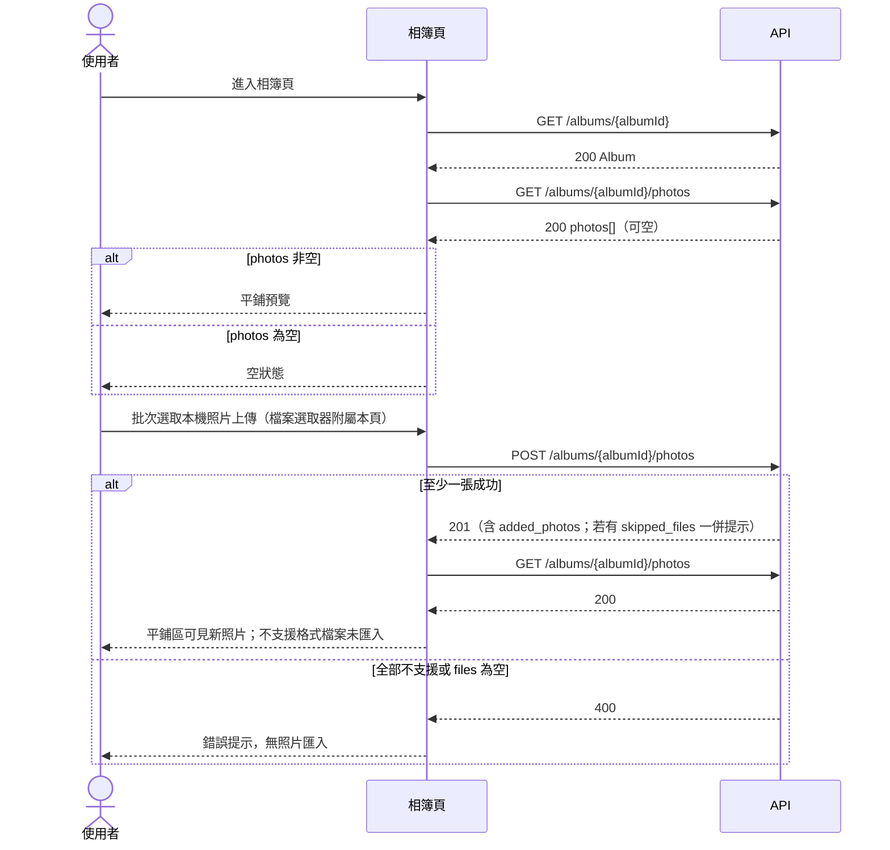

# UI 計畫：照片相簿整理應用程式

**功能分支**: `001-photo-albums`
**建立日期**: 2026-07-21
**狀態**: 草稿

## 業務邏輯 1：建立相簿並整理照片

使用者從主頁建立單層相簿，進入相簿後批次上傳本機照片，並確認照片只出現在指定相簿中。

對應：

- **US1** 建立相簿並整理照片
- **US1-FR1** 建立相簿並命名
- **US1-FR2** 將照片加入指定相簿
- **US1-FR3** 批次匯入 JPG／PNG／HEIC
- **GR-001** 相簿不可嵌套
- **AC** 建立「旅行」並加入 5 張 JPG 後，相簿存在且內含這 5 張照片

---

## 業務邏輯 2：主頁依建立日期分組瀏覽相簿

使用者回到主頁，依相簿建立日期分組查看所有相簿；無相簿的日期分組不顯示。

對應：

- **US2** 在主頁面依日期瀏覽相簿
- **US2-FR1** 主頁顯示所有相簿
- **US2-FR2** 依相簿建立日期分組
- **AC** 多個不同建立日期的相簿在主頁依日期分組顯示

---

## 業務邏輯 3：同分組內拖放重排相簿

使用者在主頁同一日期分組內拖放相簿調整順序；重開主頁後順序仍保留。

對應：

- **US3** 透過拖放重新排列相簿
- **US3-FR1** 主頁拖放重排
- **US3-FR2** 持久化排序
- **AC** 拖放後系統依新順序顯示相簿

---

## 業務邏輯 4：相簿內平鋪預覽照片

使用者進入相簿，以平鋪縮圖掃描內容；無照片時顯示可理解的空狀態。

對應：

- **US4** 在相簿內以平鋪方式預覽照片
- **US4-FR1** 進入單一相簿查看內容
- **US4-FR2** 平鋪式介面預覽
- **US4-FR3** 空狀態
- **AC** 有多張照片的相簿打開後顯示平鋪式預覽

---

## 頁面：主頁（Home）

### 職責

- **US1**（入口）：建立新相簿
- **US2**：依建立日期分組瀏覽相簿
- **US3**：同分組內拖放重排
- **US2-FR1, US2-FR2, US3-FR1, US3-FR2, US1-FR1, GR-001**

### 呈現內容

- 依 `group_date`（相簿建立日期）分組的相簿列表；每組顯示日期標題
- 每個相簿項目：`name`、`photo_count`（可選顯示）
- 同分組內依 `sort_order` 排列
- 無相簿時：清楚空狀態（可建立相簿），不造成混淆
- 僅一個相簿時：仍正常列出；拖放不應造成錯誤或混淆（US3 邊界情境）
- 不提供空白日期分組（US2 邊界情境）

### 操作 Flow

結構性禁止巢狀：主頁不提供「把相簿拖進另一相簿」的有效投放目標（GR-001）。跨日期分組拖放不在第一版範圍，系統拒絕或忽略跨組投放。

### 導覽

| 操作 | 前往頁面 |
| --- | --- |
| 建立相簿成功 | 相簿頁（新建立的 album） |
| 點選某個相簿 | 相簿頁 |
| 拖放重排 | 留在主頁 |

### API 對應

| 使用者操作 | API | 說明 |
| --- | --- | --- |
| 載入主頁相簿列表 | `GET /albums` | 依建立日期分組與組內順序呈現 |
| 建立相簿 | `POST /albums` | 名稱必填 |
| 拖放重排 | `PUT /albums/reorder` | 持久化同分組內 `sort_order` |

---

## 頁面：相簿頁（Album）

### 職責

- **US1**：批次上傳照片至相簿
- **US4**：平鋪預覽與空狀態
- **US1-FR2, US1-FR3, US4-FR1, US4-FR2, US4-FR3, GR-001**

### 呈現內容

- 相簿標題：`name`
- 有照片：平鋪縮圖網格；項目含 `thumbnail_uri`（降級顯示 `file_uri`）、`display_name`
- 無照片：空狀態，提示可上傳本機照片
- 第一版平鋪欄數固定，不提供設定 UI
- 不提供「在此相簿下建立子相簿」入口

### 操作 Flow

### 導覽

| 操作 | 前往頁面 |
| --- | --- |
| 返回 | 主頁 |
| 上傳完成 | 留在相簿頁 |

### API 對應

| 使用者操作 | API | 說明 |
| --- | --- | --- |
| 載入相簿資訊 | `GET /albums/{albumId}` | 標題列 |
| 載入平鋪照片 | `GET /albums/{albumId}/photos` | 有資料／空狀態判斷 |
| 批次上傳照片 | `POST /albums/{albumId}/photos` | multipart；部分成功回 201+skipped_files；全失敗回 400 |

---

## 頁面總覽（導覽關係）

| 頁面 | 主要 US |
| --- | --- |
| 主頁 | US2、US3；入口承載 US1 |
| 相簿頁 | US1、US4 |

---

## 假設

- 第一版為單機個人 Web 應用，不處理登入、雲端同步、跨裝置或多人共享
- 相簿為單層結構，絕不巢狀；UI 不提供建立子相簿或把相簿投放進另一相簿的有效入口
- 主頁拖放重排僅限同一 `group_date` 分組內；跨組拖放不在第一版範圍
- 相簿頁平鋪預覽欄數第一版固定，不提供設定 UI
- 僅兩個可獨立到達的全頁（主頁、相簿頁）；建立相簿 Modal、本機檔案選取器附屬於所屬頁操作 Flow
- 不使用照片庫頁或自動成冊流程；所有照片直接上傳至目標相簿
