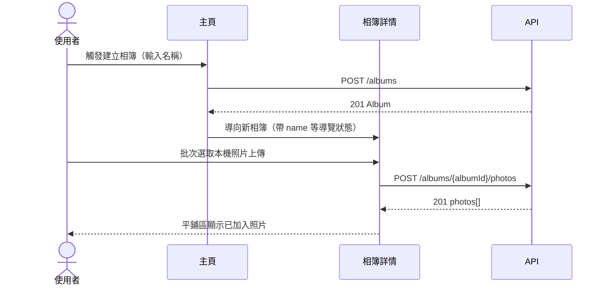
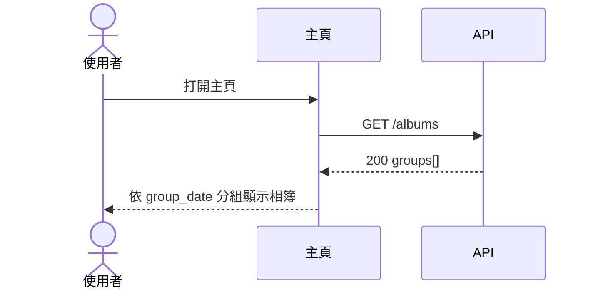
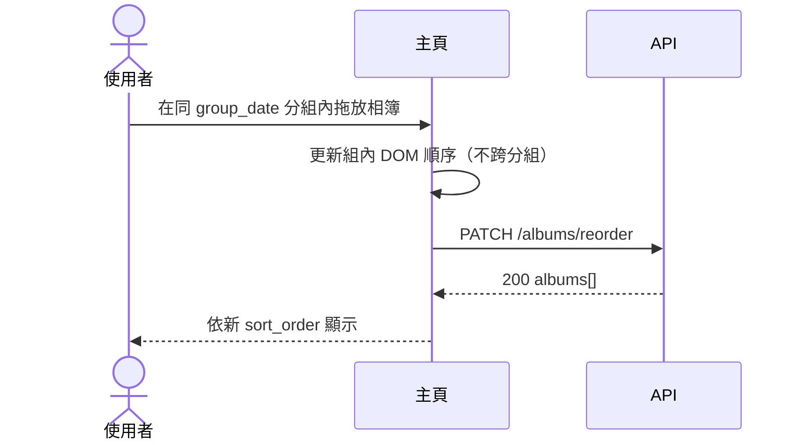
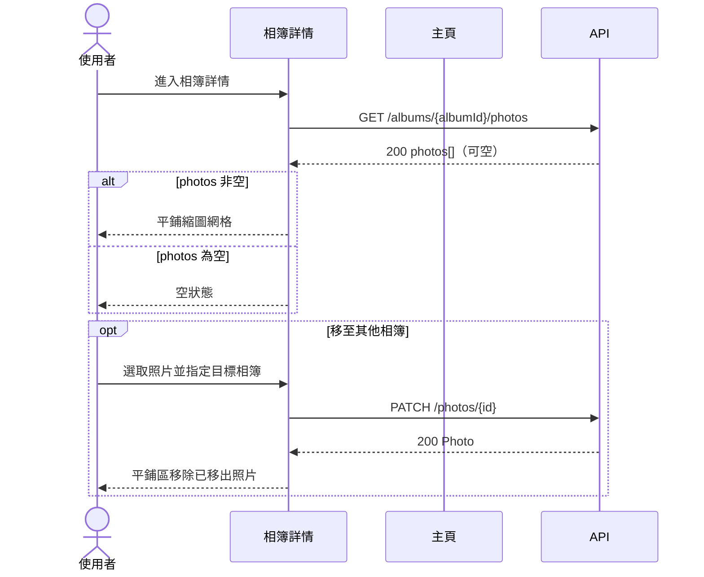
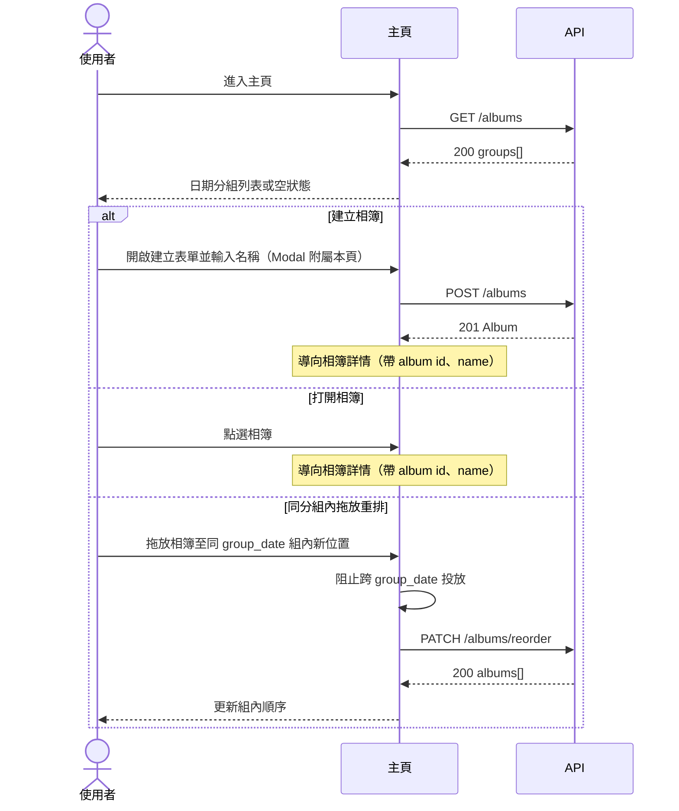
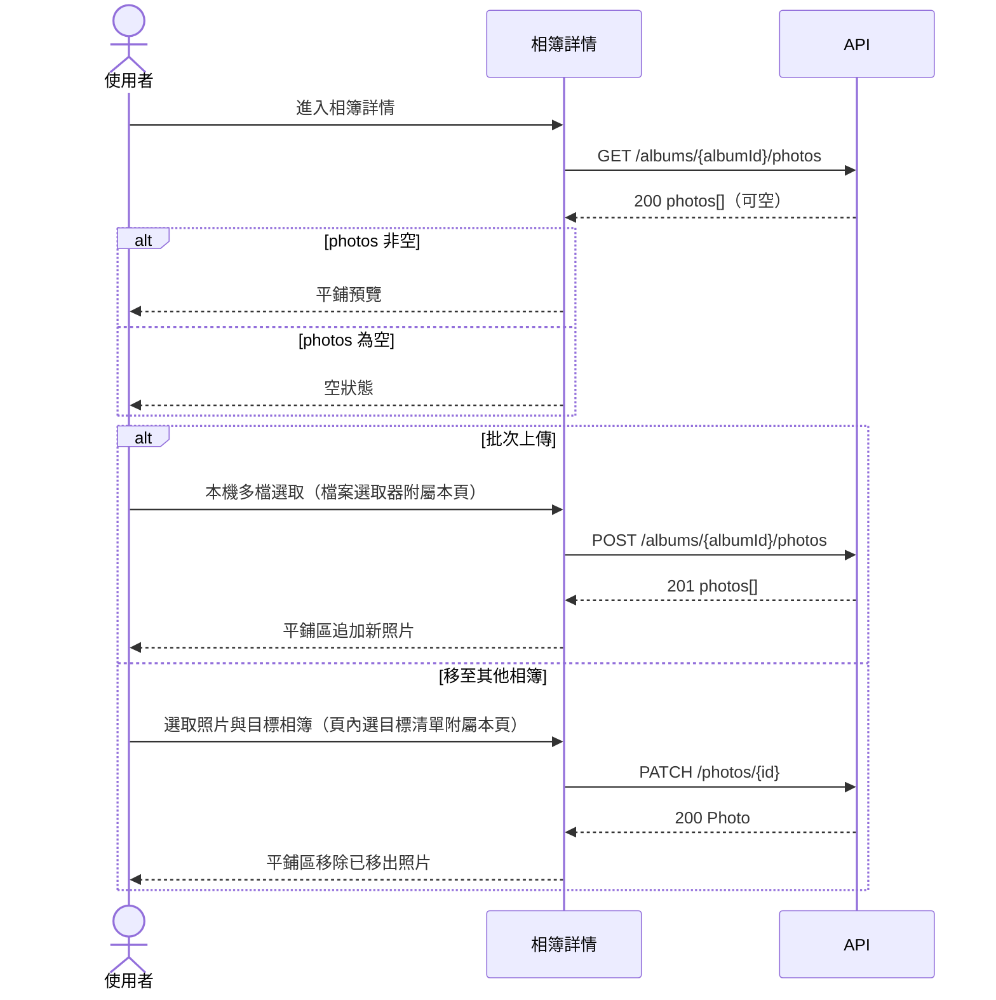
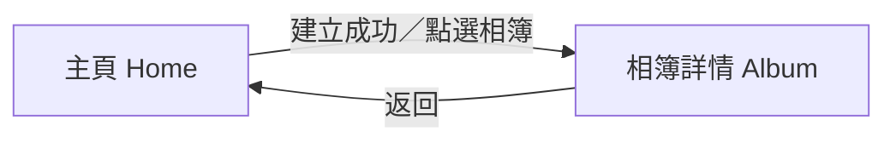

# UI 計畫：照片相簿整理應用程式

**功能分支**: `001-photo-albums`
**建立日期**: 2026-07-22
**狀態**: 草稿

## 業務邏輯 1：建立相簿並加入照片

使用者從主頁建立單層相簿，進入相簿詳情後批次選取本機 JPEG／PNG／WebP 上傳，確認照片出現在指定相簿中。

對應：

- **US-1** 建立相簿並整理照片
- **FR-001**（US1-FR1）建立相簿並命名
- **FR-002**（US1-FR2）將照片加入指定相簿
- **FR-003**（US1-FR3）一次選取多張 JPEG、PNG 或 WebP 匯入
- **GR-001** 相簿不可嵌套
- **AC-1-1** 建立「旅行」並匯入多張 JPEG／PNG／WebP 後，相簿存在且內含這些照片

---

## 業務邏輯 2：主頁依建立日期分組瀏覽相簿

使用者進入主頁，依相簿建立日期分組查看所有相簿；無相簿的日期分組不顯示。

對應：

- **US-2** 在主頁面依日期瀏覽相簿
- **FR-004**（US2-FR1）主頁顯示所有相簿
- **FR-005**（US2-FR2）依相簿建立日期分組
- **AC-2-1** 不同日期建立的相簿出現在對應日期分組之下

---

## 業務邏輯 3：同建立日分組內拖放重排相簿

使用者在主頁以原生 HTML Drag and Drop 調整同一 `group_date` 分組內的相簿順序，順序持久化後重新整理仍保留。

對應：

- **US-3** 透過拖放重新排列相簿
- **FR-006**（US3-FR1）主頁拖放重新排列相簿順序
- **FR-007**（US3-FR2）保存重新排列後的相簿順序
- **AC-3-1** 拖放後依新順序顯示相簿
- **AC-3-2** 重新整理或再次進入主頁後仍保留先前順序

---

## 業務邏輯 4：相簿內平鋪預覽、空狀態與跨相簿移動照片

使用者進入相簿詳情查看平鋪縮圖；空相簿顯示可理解空狀態。若將已屬於其他相簿的照片移入本相簿，原相簿不再包含該照片。

對應：

- **US-4** 在相簿內以平鋪方式預覽照片
- **FR-008**（US4-FR1）進入單一相簿查看內容
- **FR-009**（US4-FR2）相簿內平鋪式預覽照片
- **FR-010**（US4-FR3）相簿沒有照片時顯示可理解空狀態
- **FR-011**（US1-FR4）已歸屬照片改加入另一相簿時從原相簿移出
- **GR-002** 一張照片同一時間只屬於一個相簿
- **AC-1-2** 已屬於相簿 A 的照片移入相簿 B 後，只出現在相簿 B
- **AC-4-1** 含多張照片的相簿以平鋪式預覽顯示

---

## 頁面：主頁（Home）

### 職責

- **US-1**（入口）：建立新相簿
- **US-2**：依建立日期分組瀏覽相簿
- **US-3**：同 `group_date` 分組內拖放重排

### 呈現內容

- 依 `group_date` 分組的相簿列表；每組顯示日期標題（由 `created_at` 日期部分衍生）
- 同分組內依 `sort_order` 升冪排列；項目含 `name`、`photo_count`
- 無相簿時：清楚空狀態，提示可建立第一個相簿
- 載入中：列表區顯示載入指示；API 錯誤時顯示可重試訊息
- 建立相簿表單（Modal 附屬本頁）：名稱輸入；驗證失敗顯示錯誤（如 name 空白）

### 操作 Flow

結構性禁止巢狀：主頁不提供「把相簿拖進另一相簿」的有效投放目標（GR-001）。僅一個相簿的分組內，拖放不造成錯誤或混淆互動（US3 邊界情境）。

### 導覽

| 操作 | 前往頁面 |
| --- | --- |
| 建立相簿成功 | 相簿詳情（新建立的 album） |
| 點選某個相簿 | 相簿詳情 |
| 拖放重排 | 留在主頁 |

### API 對應

| 使用者操作 | API | 說明 |
| --- | --- | --- |
| 載入主頁相簿列表 | `GET /albums` | 依 `group_date` 分組與組內 `sort_order` 呈現 |
| 建立相簿 | `POST /albums` | `name` 必填且不可空白 |
| 拖放重排 | `PATCH /albums/reorder` | 請求含 `group_date` 與該組全部 `album_ids` 新順序 |

---

## 頁面：相簿詳情（Album）

### 職責

- **US-1**：批次上傳照片至相簿
- **US-4**：平鋪預覽與空狀態
- **US-1**（驗證端）：將已歸屬照片移至其他相簿（US1-FR4）

### 呈現內容

- 相簿標題：`name`（由導覽狀態帶入；建立或主頁點選時已取得，不依賴獨立 GET 相簿 endpoint）
- 上傳入口：觸發本機檔案選取器（附屬本頁），接受 JPEG／PNG／WebP
- 有照片：平鋪縮圖網格，依 `created_at` 升冪；縮圖優先 `thumbnail_url`，為 `null` 時降級 `original_url`
- 無照片：空狀態，提示可上傳本機照片
- 每張照片可操作「移至其他相簿」（附屬本頁選目標清單）；目標清單來自已快取或重新載入的相簿資料
- 上傳／移動失敗：顯示 API 錯誤（如 415 不支援格式、400 驗證錯誤）

### 操作 Flow

不支援格式（如 HEIC）時，顯示 415 訊息並說明僅支援 JPEG、PNG、WebP（US1 邊界情境）。相簿不存在（404）時導回主頁並提示。

### 導覽

| 操作 | 前往頁面 |
| --- | --- |
| 返回 | 主頁 |
| 上傳完成 | 留在相簿詳情 |
| 移至其他相簿成功 | 留在相簿詳情 |
| 相簿不存在（404） | 主頁 |

### API 對應

| 使用者操作 | API | 說明 |
| --- | --- | --- |
| 載入平鋪照片 | `GET /albums/{albumId}/photos` | 有資料／空狀態判斷；依 `created_at` 升冪 |
| 批次上傳照片 | `POST /albums/{albumId}/photos` | multipart `files` 欄位，可多檔 |
| 將照片移至其他相簿 | `PATCH /photos/{id}` | 請求 body 含目標 `album_id`；落實 GR-002 |
| 載入移動目標相簿清單 | `GET /albums` | 展開 `groups[].albums` 供選目標（排除目前相簿） |

---

## 頁面總覽（導覽關係）

| 頁面 | 主要 US |
| --- | --- |
| 主頁 | US-2、US-3；入口承載 US-1 |
| 相簿詳情 | US-1、US-4 |

---

## 假設

- 第一版為單機個人 Web 應用（Vanilla Vite 前端），不處理登入、雲端同步或多人共享
- 相簿為單層結構，絕不巢狀（GR-001）；主頁不提供相簿對相簿投放目標
- 主頁拖放重排僅限同一 `group_date`（建立日）分組內，使用原生 HTML Drag and Drop；跨分組拖放由前端阻止
- 僅兩個可獨立到達的全頁（主頁、相簿詳情）；Modal、檔案選取器、移動目標選單附屬於所屬頁操作 Flow
- 相簿詳情標題 `name` 由導覽狀態帶入（來自 `GET /albums` 或 `POST /albums` 回應），本期不另呼叫 `GET /albums/{albumId}`
- 平鋪預覽固定依 `photos.created_at` 升冪；相簿內不提供照片拖放排序
- 僅支援 JPEG、PNG、WebP；縮圖失敗時 `thumbnail_url` 為 `null`，前端降級顯示 `original_url`
- 「移至其他相簿」為相簿詳情頁內附屬操作，以 `PATCH /photos/{id}` 落實 US1-FR4；不提供相簿巢狀或照片多重歸屬
- REST 實際路徑掛載於 `/api` 前綴；媒體經 `/media/` 同 origin 提供；開發期 Vite proxy 轉發 `/api` 與 `/media`
- 刪除相簿本期不開 DELETE UI 或 Endpoint；低風險預設為後端 cascade（見 api-plan 假設）
