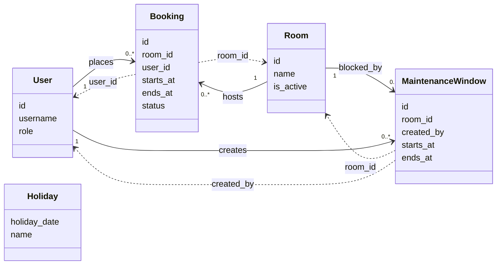

# 資料計畫：內部共享會議室預約系統

**功能分支**: `002-meeting-room-booking`
**建立日期**: 2026-07-30
**狀態**: 草稿

## 實體：User（使用者）

以帳密登入的系統帳號；角色區分一般員工、部門主管、設施管理員。第一版主管預約能力與員工相同。

| 欄位 | 型別 | 必填 | 說明 | 驗證規則 | 對應 User Story |
| --- | --- | --- | --- | --- | --- |
| `id` | UUID | 系統產生 | 使用者主鍵 | 主鍵，全域唯一 | — |
| `username` | TEXT | 是 | 登入帳號 | 非空白；全域唯一 (US1-FR1) | US1 |
| `password_hash` | TEXT | 是 | 密碼雜湊 | 非空白；不明文存放 (US1-FR1) | US1 |
| `display_name` | TEXT | 是 | 顯示名稱 | 非空白 | US1, US2 |
| `role` | TEXT | 是 | 角色 | 限 `employee`、`manager`、`facility_admin` (US1-FR1, US4-FR4) | US1, US4 |
| `created_at` | TIMESTAMPTZ | 系統產生 | 建立時間（UTC 瞬間） | 預設 now() | — |

### 衍生屬性

無

### 範例資料輸出

```json
{
  "id": "11111111-1111-4111-8111-111111111111",
  "username": "alice",
  "display_name": "Alice",
  "role": "employee",
  "created_at": "2026-07-30T01:00:00.000Z"
}
```

---

## 實體：Room（會議室）

可被預約的空間；含樓層、容納人數與設備標誌；可啟用或停用。

| 欄位 | 型別 | 必填 | 說明 | 驗證規則 | 對應 User Story |
| --- | --- | --- | --- | --- | --- |
| `id` | UUID | 系統產生 | 會議室主鍵 | 主鍵，全域唯一 | — |
| `name` | TEXT | 是 | 會議室名稱 | 非空白 (US1-FR2, US4-FR1) | US1, US4 |
| `floor` | TEXT | 是 | 樓層標示 | 非空白 (US1-FR2, US4-FR1) | US1, US4 |
| `capacity` | INTEGER | 是 | 容納人數 | 正整數 ≥ 1 (US1-FR6, US4-FR1) | US1, US4 |
| `has_projector` | BOOLEAN | 是 | 是否有投影機 | 布林 (US1-FR2, US4-FR1) | US1, US4 |
| `has_video_conference` | BOOLEAN | 是 | 是否有視訊設備 | 布林 (US1-FR2, US4-FR1) | US1, US4 |
| `is_active` | BOOLEAN | 是 | 是否接受新預約 | 預設 true；false 時擋新約 (US4-FR2, GR-003) | US1, US4 |
| `created_at` | TIMESTAMPTZ | 系統產生 | 建立時間（UTC 瞬間） | 預設 now() | — |
| `updated_at` | TIMESTAMPTZ | 系統產生 | 最後更新時間 | 寫入時更新 | US4 |

### 衍生屬性

無

### 範例資料輸出

```json
{
  "id": "22222222-2222-4222-8222-222222222222",
  "name": "大會議A",
  "floor": "3F",
  "capacity": 12,
  "has_projector": true,
  "has_video_conference": true,
  "is_active": true,
  "created_at": "2026-07-30T01:00:00.000Z",
  "updated_at": "2026-07-30T01:00:00.000Z"
}
```

---

## 實體：Booking（預約）

使用者對會議室的單次占用結果；建立成功即為已確認，可改為已取消。

| 欄位 | 型別 | 必填 | 說明 | 驗證規則 | 對應 User Story |
| --- | --- | --- | --- | --- | --- |
| `id` | UUID | 系統產生 | 預約主鍵 | 主鍵，全域唯一 | — |
| `room_id` | UUID | 是 | 會議室 | 對應 `Room.id`（關聯見實體關聯設計）(US1-FR3) | US1 |
| `user_id` | UUID | 是 | 預約者 | 對應 `User.id` (US1-FR3, US3-FR1) | US1, US3 |
| `purpose` | TEXT | 是 | 用途 | 非空白 (US1-FR3) | US1 |
| `attendee_count` | INTEGER | 是 | 預期人數 | 正整數 ≥ 1；不得超過該室 `capacity` (US1-FR3, US1-FR6) | US1 |
| `needs_projector` | BOOLEAN | 是 | 是否需要投影機 | 布林 (US1-FR3) | US1 |
| `needs_video_conference` | BOOLEAN | 是 | 是否需要視訊 | 布林 (US1-FR3) | US1 |
| `starts_at` | TIMESTAMPTZ | 是 | 開始瞬間（UTC） | 早於 `ends_at`；業務規則見約束清單 (US1-FR3, GR-002) | US1, US2 |
| `ends_at` | TIMESTAMPTZ | 是 | 結束瞬間（UTC） | 晚於 `starts_at` (US1-FR3, GR-002) | US1, US2 |
| `status` | TEXT | 是 | 狀態 | 限 `confirmed`、`cancelled`；新建為 `confirmed` (US1-FR4, US3-FR3) | US1, US3 |
| `created_at` | TIMESTAMPTZ | 系統產生 | 建立時間 | 預設 now() | — |
| `updated_at` | TIMESTAMPTZ | 系統產生 | 最後更新時間 | 取消時更新 | US3 |

### 衍生屬性

- **`is_cancellable`（可否取消）**：查詢計算。當 `status = confirmed` 且 `ends_at` 尚未早於「現在」時為 true（US3-FR2）。不落庫。

### 範例資料輸出

```json
{
  "id": "33333333-3333-4333-8333-333333333333",
  "room_id": "22222222-2222-4222-8222-222222222222",
  "user_id": "11111111-1111-4111-8111-111111111111",
  "purpose": "產品週會",
  "attendee_count": 6,
  "needs_projector": true,
  "needs_video_conference": false,
  "starts_at": "2026-07-31T06:00:00.000Z",
  "ends_at": "2026-07-31T07:00:00.000Z",
  "status": "confirmed",
  "created_at": "2026-07-30T02:00:00.000Z",
  "updated_at": "2026-07-30T02:00:00.000Z"
}
```

---

## 實體：MaintenanceWindow（維護時段）

管理員為指定會議室設定的不可新預約區間（黑名單時段）。

| 欄位 | 型別 | 必填 | 說明 | 驗證規則 | 對應 User Story |
| --- | --- | --- | --- | --- | --- |
| `id` | UUID | 系統產生 | 維護時段主鍵 | 主鍵，全域唯一 | — |
| `room_id` | UUID | 是 | 會議室 | 對應 `Room.id` (US4-FR3) | US4 |
| `starts_at` | TIMESTAMPTZ | 是 | 開始瞬間（UTC） | 早於 `ends_at` (US4-FR3) | US4 |
| `ends_at` | TIMESTAMPTZ | 是 | 結束瞬間（UTC） | 晚於 `starts_at` (US4 邊界) | US4 |
| `note` | TEXT | 否 | 維護說明 | 可空 | US4 |
| `created_by` | UUID | 是 | 建立者（管理員） | 對應 `User.id` (US4-FR3) | US4 |
| `created_at` | TIMESTAMPTZ | 系統產生 | 建立時間 | 預設 now() | — |

### 衍生屬性

無

### 範例資料輸出

```json
{
  "id": "44444444-4444-4444-8444-444444444444",
  "room_id": "22222222-2222-4222-8222-222222222222",
  "starts_at": "2026-08-01T01:00:00.000Z",
  "ends_at": "2026-08-01T04:00:00.000Z",
  "note": "空調維修",
  "created_by": "55555555-5555-4555-8555-555555555555",
  "created_at": "2026-07-30T03:00:00.000Z"
}
```

---

## 實體：Holiday（假日）

以 Asia/Taipei 日曆日表示不可預約的假日；供應用層拒絕假日預約（GR-002）。

| 欄位 | 型別 | 必填 | 說明 | 驗證規則 | 對應 User Story |
| --- | --- | --- | --- | --- | --- |
| `holiday_date` | DATE | 是 | 台北日曆日 | 主鍵；唯一 (GR-002) | US1 |
| `name` | TEXT | 是 | 假日名稱 | 非空白 | US1 |

### 衍生屬性

無

### 範例資料輸出

```json
{
  "holiday_date": "2026-10-10",
  "name": "國慶日"
}
```

---

## 約束清單

> 僅列實體內部欄位／屬性約束。實體之間的關聯形狀與理由見下方「實體關聯設計」。

- 因為必須以帳密登入且角色可區分（US1-FR1），所以 `users.username` 全域唯一且非空白，`users.role` 僅允許三種列舉值，`password_hash` 必填且不明文。
- 因為會議室清單需顯示名稱、樓層、容納與設備（US1-FR2, US4-FR1），所以對應欄位必填；`capacity` 必須為 ≥ 1 的整數。
- 因為停用後不得接受新預約且不得自動取消既有預約（US4-FR2, GR-003），所以以 `rooms.is_active` 布林表達啟用狀態，不以刪列代表停用。
- 因為預約必須記錄用途、人數與設備需求（US1-FR3），所以 `purpose` 非空白，`attendee_count` ≥ 1，設備需求以兩個布林欄位表達。
- 因為預期人數不可超過容納人數（US1-FR6），所以建立預約時應用層比對 `attendee_count` 與該室 `capacity`（不在 Booking 表重複存容量上限）。
- 因為建立成功即已確認、取消後釋放時段（US1-FR4, US3-FR3），所以 `status` 僅 `confirmed`／`cancelled`，新建必為 `confirmed`。
- 因為同一會議室不可兩筆已確認時段重疊（GR-001），所以僅 `confirmed` 預約參與時段互斥；取消列不佔用互斥。
- 因為營業語意以 Asia/Taipei 且單筆須同日、平日 09:00–21:00、時長 30 分～4 小時、假日不可約（GR-002），所以時間規則由應用層在寫入前校驗；DB 僅保證 `ends_at > starts_at`。
- 因為維護時段結束必須晚於開始（US4 邊界），所以 `maintenance_windows.ends_at > starts_at`。
- 因為假日以台北日曆日判定（GR-002、technical-research 假設），所以 `holidays.holiday_date` 為 DATE 主鍵，不存時區瞬間。

---

## 實體關聯設計



### 設計脈絡

- 因為每筆預約恰有一位預約者與一間會議室（US1-FR3），所以 `User`／`Room` 對 `Booking` 皆為 `1` — `0..*`，不另建中介實體。
- 因為取消是改狀態而非刪歷史（US3-FR1, US3-FR3），所以刪使用者／會議室時不採「級聯刪光預約」為預設；停用會議室不刪預約列（GR-003）。
- 因為維護時段隸屬單一會議室並由管理員建立（US4-FR3），所以 `MaintenanceWindow` 以 `room_id` 與 `created_by` 分別連到 `Room` 與 `User`。
- 因為第一版不做與會者邀請（spec 假設），所以不建立與會者／回覆實體，亦不在圖上預留邀請邊。
- 因為假日是全域日曆規則而非依附會議室（GR-002），所以 `Holiday` 無指向 `Room`／`Booking` 的關聯邊；由應用層在建立預約時查表。

## 假設

- 第一版無候補、審核、重複系列、與會者實體；設備需求以兩個布林欄位表達，不另建設備主檔
- 週末不可預約由應用層依 Asia/Taipei 星期判定；國定假日以 `holidays` 種子表為準
- 時段重疊語意採半開區間 `[starts_at, ends_at)`；DB exclusion 與應用檢查一致
- Session 存放由 `connect-pg-simple` 管理，不納入本領域實體集合
- `password_hash` 僅存雜湊；API 回應永不回傳該欄
