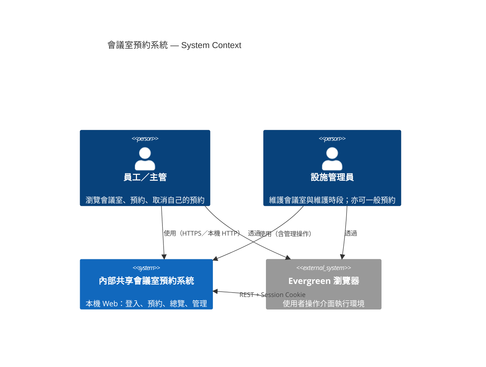
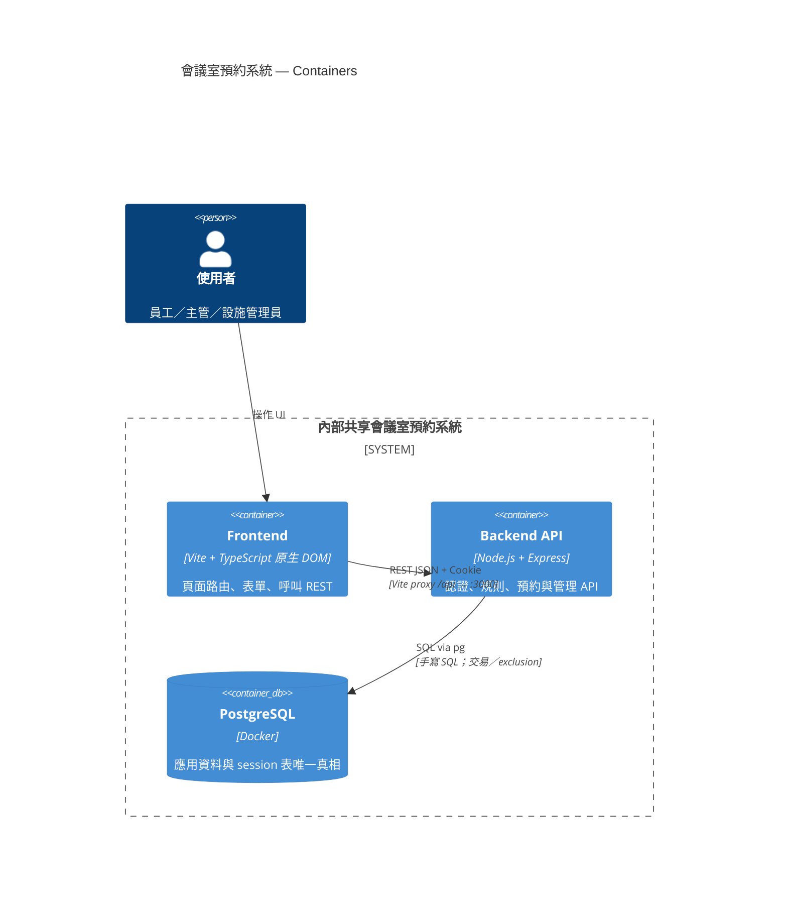

# 技術可行性研究：內部共享會議室預約系統

**功能分支**: `002-meeting-room-booking`
**建立日期**: 2026-07-30
**狀態**: 草稿

## 決策 1: 採用 monorepo 前後端分離與 REST 整合

- **Decision**: 採 monorepo，應用碼分置 `backend/` 與 `frontend/`；前後端僅以 REST 整合；前端不得直連資料庫；第一版不引入 GraphQL 或 message queue
- **Rationale**:
  - 對齊專案憲法與 `spec.md`「前後端皆交付、本機可跑」
  - UI、HTTP 契約、持久化邊界清楚，便於後續 data／api／ui-plan 對齊
  - 內部預約系統無需 SSR 或即時推播管線
- **Alternatives considered**:
  - 單體 SSR（Next.js／Nuxt）：憲法禁止 React／Vue 執行期，且提高耦合
  - GraphQL：憲法禁止；本期查詢形狀固定，REST 足夠
  - 前後端合一單一靜態伺服且前端直連 DB：違反「前端不旁路存取資料儲存」

## 決策 2: 前端以 Vite + TypeScript 原生實作，日曆不引排程套件

- **Decision**: 使用 `Vite` 做開發／建置；執行期使用 TypeScript 編譯後的原生 DOM／fetch，不引入 React／Vue／Angular；路由採輕量 History API 自管；日曆與列表以同一「預約瀏覽」頁切換、原生 CSS Grid／表格實作，不引入 FullCalendar 等排程函式庫
- **Rationale**:
  - 對齊憲法前端基線與「最小依賴」
  - 頁面集合有限（登入、首頁忙碌、預約瀏覽、建立預約、我的預約、管理），自管路由足夠
  - 營業窗 09:00–21:00、以檢視為主的日曆不需完整排程編輯器
- **Alternatives considered**:
  - React／Vue／Angular SPA：憲法禁止執行期 UI framework
  - FullCalendar／同類日曆套件：依賴與樣式耦合過重，超出「檢視預約」需求
  - 重量級前端 router／狀態庫：頁面少，收益低於成本

## 決策 3: 後端以 Express + pg 手寫 SQL，會話存 PostgreSQL

- **Decision**: 後端核心套件為 `express`、`pg`、`bcrypt`、`dotenv`、`express-session`、`connect-pg-simple`；UUID 使用 Node 內建 `crypto.randomUUID()`；不以 ORM／query builder 存取資料；認證採伺服端 session（HttpOnly cookie），session 存放於 PostgreSQL
- **Rationale**:
  - 完全對齊憲法後端與資料存取禁准項
  - 內部帳密＋可登出撤銷；session 入庫避免引入 Redis，維持單一 DB 真相
  - 密碼雜湊與一致錯誤形狀（`error.code`／`error.message`）可用最小套件完成
- **Alternatives considered**:
  - Prisma／TypeORM／Sequelize 或 Knex／Kysely：憲法禁止
  - JWT 無狀態登入：登出／撤銷成本高，對第一版內部 Web 無額外價值
  - 記憶體 session 或 Redis session：重啟易丟或另增依賴，不符最小依賴與單庫假設

## 決策 4: PostgreSQL 為唯一主庫，以交易與 exclusion 保證不超賣

- **Decision**: 應用主庫為 PostgreSQL（本機 Docker Compose 為準）；瞬間欄位用 `TIMESTAMPTZ`（UTC 存）；對外 ID 用 UUID；預約衝突在交易內鎖會議室並檢查重疊，並以 `btree_gist` partial exclusion（僅 `status = 'confirmed'`）做 DB 硬保證；營業窗、時長、不跨日、假日、容量、停用與維護時段擋新約由應用層集中校驗
- **Rationale**:
  - 對齊憲法儲存／時區／ID 基線與 spec「併發最多一筆已確認」
  - exclusion 只涵蓋已確認，取消後時段可再約；停用不級聯取消既有預約（GR-003）
  - 假日與台北日界語意不適合只靠 SQL 片段散落各處
- **Alternatives considered**:
  - SQLite／MySQL 當主庫：憲法禁止
  - 僅應用層檢查、無交易／無鎖：併發可雙確認超賣
  - 引入 Redis 分散式鎖：spec／憲法傾向最小依賴，單庫交易已足夠
  - 取消改為刪列：不利「我的預約」歷史與稽核

## 決策 5: 本機整合採 Vite proxy 與種子／重置腳本，無第三方外部整合

- **Decision**: 開發期前端 `Vite :5173` 以 proxy 將 `/api` 轉發至 `Express :3000`，再連 Docker PostgreSQL `:5432`；機密與連線只走環境變數；E2E／本機驗證以 SQL／Node seed 與 `TRUNCATE`（或等價）重置後重灌；本期無 SSO、email、MQ、外部假日 API 等第三方整合
- **Rationale**:
  - proxy 讓瀏覽器視角同源，降低 CORS／cookie 設定風險，利於 session cookie
  - 對齊「本機可跑、站內狀態即可、不接真實 mail server」假設
  - 可重現種子帳號與今日忙碌資料，支撐關鍵路徑客觀驗證
- **Alternatives considered**:
  - 前後端分 origin 直連且依賴複雜 CORS：易造成登入假失敗
  - 接公司 SSO／真實 SMTP：超出第一版範圍與本機可重現性
  - 外部國定假日 API：本機／E2E 不穩定；改以本機 `holidays` 表或等價種子

## C4 模型（技術結構視圖）

> 職責：描述系統與外部的關係，以及執行期容器切分。  
> **不**取代 OOA 的 Class／Sequence（問題域物件與行為見 `system-analyze/ooa.md`）。  
> 第一版畫到 **Context + Container**；Component 層省略（避免與 OOA Class 重疊）。

### C4 Context

**說明**

- 第一版無 SSO、email、外部假日 API、MQ 等外部業務系統；唯一「人↔系統」邊界如上。
- 瀏覽器標為執行環境，強調前端不直連 DB。

### C4 Container

**說明**

- 三容器：`web`／`api`／`db`，對齊 monorepo `frontend/`、`backend/` 與憲法「前端不旁路存取資料庫」。
- Session 存在 PostgreSQL（`connect-pg-simple`），不另建 Redis 容器。
- 物件職責與用例互動不在此圖展開 → 見 `ooa.md`。

## 假設

- 對齊 `spec.md`：無候補、無審核、無重複預約、無與會者邀請；主管角色與員工預約能力相同
- 假日不可約：第一版以本機假日表（及週末檢查）實作，不接外部日曆服務
- 開發期以 Vite proxy 為預設；若改為分 port 直連，再顯式設定 CORS＋`credentials`
- Node.js 採用現行 LTS（實作時鎖定 minor 於 `package.json`／文件）
- 前端「今天／營業日」顯示與表單預檢以 `Asia/Taipei` 輔助函式處理，但衝突與規則真相以後端為準
