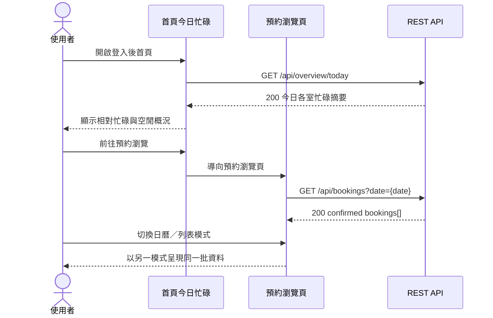
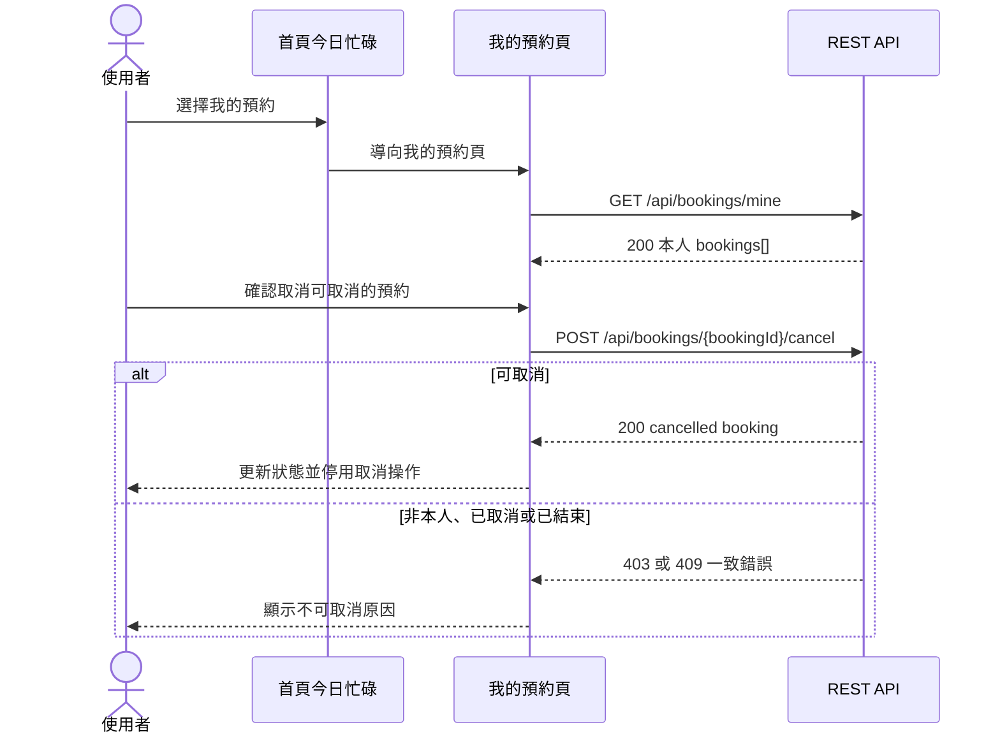
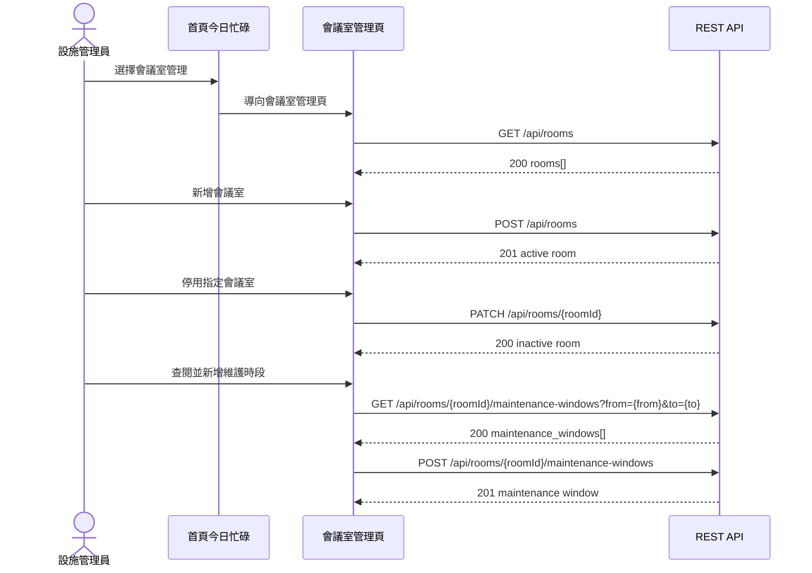
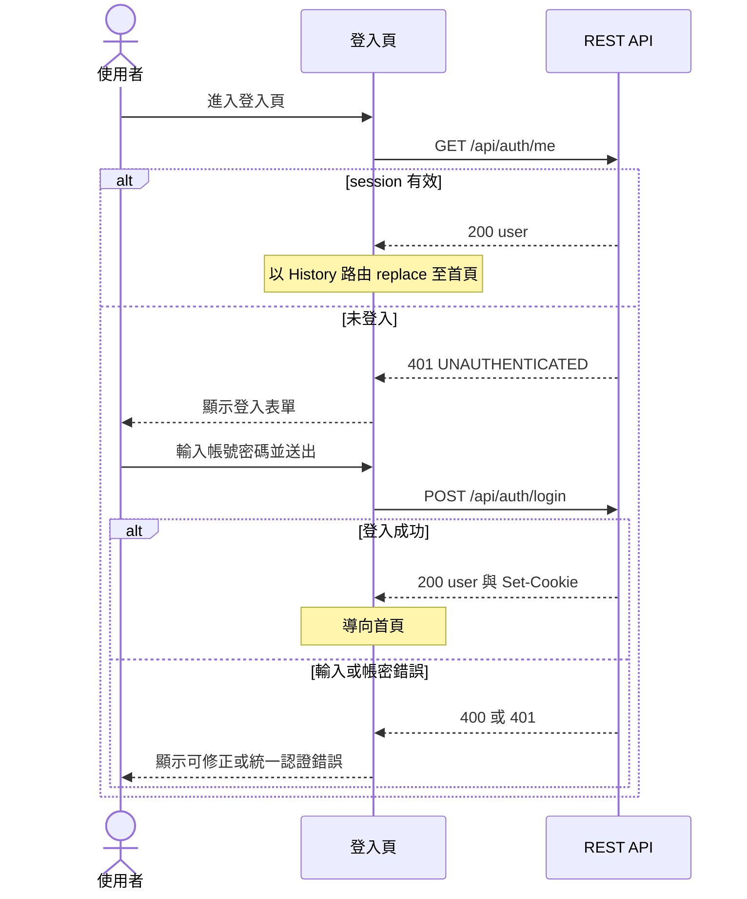
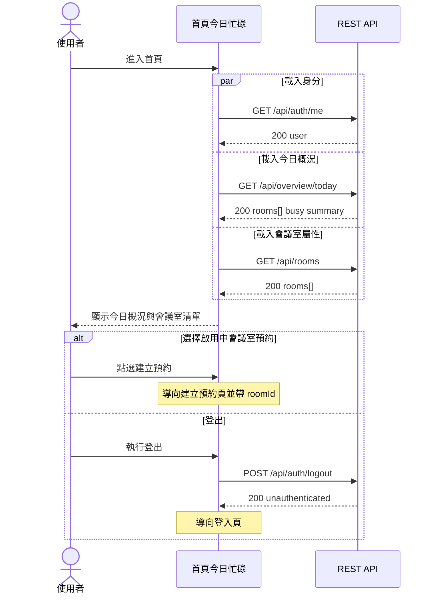
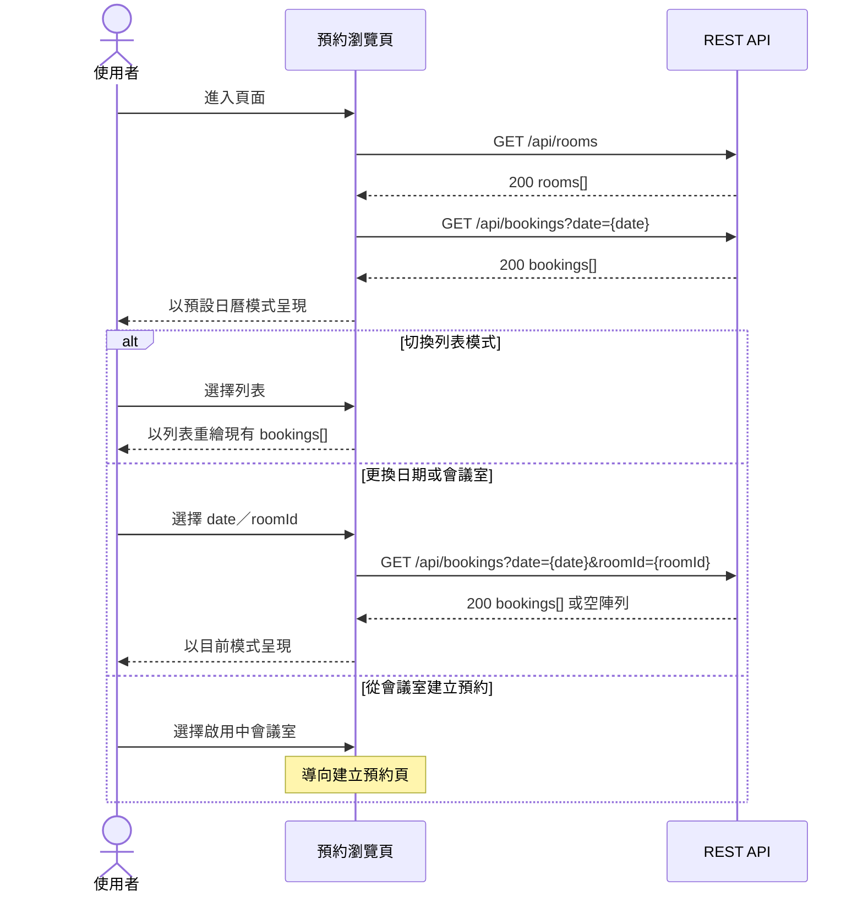
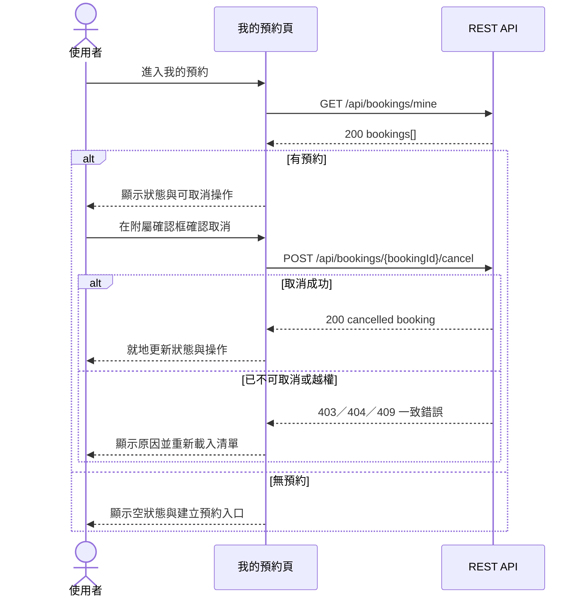
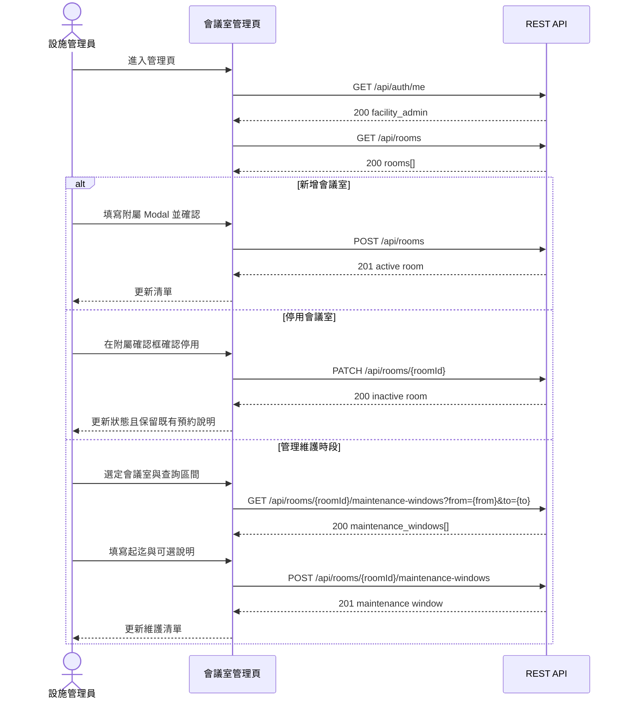
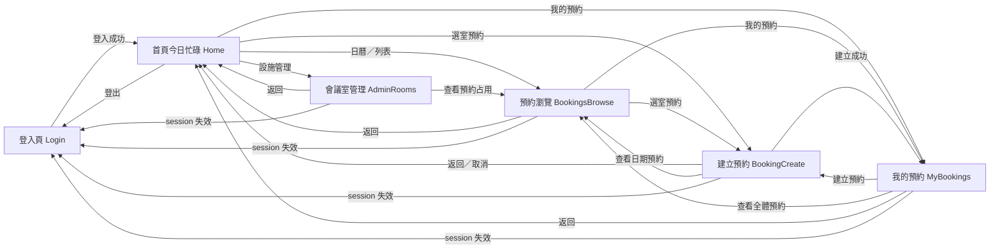

# UI 計畫：內部共享會議室預約系統

**功能分支**: `002-meeting-room-booking`
**建立日期**: 2026-07-30
**狀態**: 草稿

## 業務邏輯 1：登入後瀏覽會議室並完成單次預約

使用者以帳號密碼登入，由 session cookie 維持身分；進入首頁瀏覽會議室後，前往建立預約頁選室、填寫單次預約資料並取得已確認結果，違反時段、容量、設備、停用或衝突規則時留在原頁修正。

```mermaid
sequenceDiagram
    actor U as 使用者
    participant Login as 登入頁
    participant Home as 首頁今日忙碌
    participant Create as 建立預約頁
    participant Mine as 我的預約頁
    participant API as REST API

    U->>Login: 輸入帳號密碼登入
    Login->>API: POST /api/auth/login
    API-->>Login: 200 使用者與 session cookie
    Login->>Home: 導向首頁
    Home->>API: GET /api/rooms
    API-->>Home: 200 rooms[]
    U->>Home: 選擇會議室並開始預約
    Home->>Create: 導向建立預約頁
    Create->>API: GET /api/rooms/{roomId}/maintenance-windows?from={from}&to={to}
    API-->>Create: 200 maintenance_windows[]
    U->>Create: 填寫並送出單次預約
    Create->>API: POST /api/bookings
    alt 規則通過
        API-->>Create: 201 confirmed booking
        Create->>Mine: 導向我的預約頁
    else 規則、預約或維護衝突
        API-->>Create: 400 或 409 一致錯誤
        Create-->>U: 顯示可理解原因並保留可修正輸入
    end
```

對應：

- **US-1** 登入後瀏覽會議室並完成單次預約
- **US1-FR1**（FR-1-1）帳號密碼登入並區分三角色
- **US1-FR2**（FR-1-2）瀏覽會議室屬性與啟用狀態
- **US1-FR3～US1-FR6**（FR-1-3～FR-1-6）建立已確認預約並拒絕不合法、超量或衝突請求
- **AC-1-1** 合法資料建立已確認預約
- **AC-1-2** 同室重疊時段被拒絕並提示衝突
- **AC-1-3** 未登入不得建立預約

---

## 業務邏輯 2：首頁／日曆／列表掌握忙碌與預約

已登入使用者先在首頁掌握 Asia/Taipei 今日各室忙碌程度，再進入同一個預約瀏覽頁，以日曆／列表兩種頁內模式查看同一日期、同一資料來源的已確認預約。



對應：

- **US-2** 以首頁、日曆與列表掌握會議室預約狀況
- **US2-FR1**（FR-2-1）首頁呈現今日各會議室忙碌概況
- **US2-FR2～US2-FR4**（FR-2-2～FR-2-4）以日曆與列表呈現已確認預約摘要
- **AC-2-1** 首頁可區分今日忙碌與全日空閒會議室
- **AC-2-2** 日曆模式依時段顯示預約
- **AC-2-3** 列表模式列出足以辨識會議室與時段的預約

---

## 業務邏輯 3：查看並取消自己的預約

已登入使用者由全域導覽進入自己的預約清單，查看已確認與已取消紀錄；僅可對本人、尚未結束且已確認的預約執行取消，成功後就地更新狀態並釋放時段。



對應：

- **US-3** 查看並取消自己的預約
- **US3-FR1**（FR-3-1）顯示本人已確認與已取消預約
- **US3-FR2～US3-FR4**（FR-3-2～FR-3-4）僅允許取消本人尚未結束的已確認預約並釋放時段
- **AC-3-1** 我的預約列出本人未來預約
- **AC-3-2** 取消成功後狀態改為已取消且時段可再約
- **AC-3-3** 嘗試取消他人預約時被拒絕

---

## 業務邏輯 4：管理員維護會議室與維護時段

設施管理員由登入後全域導覽進入會議室管理頁，在單一全頁中新增、停用會議室，並以附屬表單管理指定會議室的維護時段；一般員工與主管不顯示管理入口，後端仍以角色拒絕越權操作。



對應：

- **US-4** 管理員維護會議室與不可預約時段
- **US4-FR1**（FR-4-1）設施管理員新增會議室
- **US4-FR2**（FR-4-2）停用會議室但不取消既有預約
- **US4-FR3**（FR-4-3）查閱並設定維護黑名單時段
- **US4-FR4**（FR-4-4）拒絕一般員工與主管執行管理操作
- **AC-4-1** 新增會議室後員工可見且可預約
- **AC-4-2** 維護時段內的新預約被拒絕
- **AC-4-3** 停用只擋新預約且保留既有已確認預約
- **AC-4-4** 非設施管理員的管理操作被拒絕

---

## 頁面：登入頁（Login）

### 職責

- **US1／US1-FR1**：提供帳號密碼登入入口，建立 session cookie
- **AC-1-3（US1 驗收情境 3）**：未登入使用者停留或被導回本頁，不得進行受保護操作

### 呈現內容

- 帳號與密碼必填欄位、登入操作
- 送出中的載入狀態，避免重複提交
- 欄位缺漏提示，以及帳密錯誤的統一提示；不揭露帳號是否存在
- 已有有效 session 時不重複顯示表單，直接導向首頁

### 操作 Flow



所有 `fetch` 依同源 Vite proxy 與 session cookie 運作；前端不保存 session token。

### 導覽

| 操作 | 前往頁面 |
| --- | --- |
| 登入成功或已有有效 session | 首頁今日忙碌 |
| 登入失敗 | 留在登入頁 |

### API 對應

| 使用者操作 | API | 說明 |
| --- | --- | --- |
| 檢查既有登入狀態 | `GET /api/auth/me` | 取得目前使用者與角色；401 時顯示登入表單 |
| 帳號密碼登入 | `POST /api/auth/login` | 成功建立伺服端 session 與 HttpOnly cookie |

---

## 頁面：首頁今日忙碌（Home）

### 職責

- **US2／US2-FR1**：呈現 Asia/Taipei 今日各會議室的相對忙碌程度
- **US1／US1-FR2**：提供會議室瀏覽與建立預約入口
- **US3、US4**：提供我的預約入口，以及僅設施管理員可見的管理入口

### 呈現內容

- 登入使用者顯示名稱與角色、登出操作、全域主要導覽
- 今日日期、時區語意與每間會議室的名稱、啟用狀態、預約筆數、已占用分鐘及忙碌比例
- 會議室清單的樓層、容量、投影機／視訊設備與啟用狀態
- 今日完全無預約時仍顯示各室「皆空閒／無預約」；載入失敗顯示可重試狀態
- 啟用中會議室提供建立預約入口；停用會議室清楚標示不可新約且不提供有效預約操作

### 操作 Flow



任一受保護 API 回 `401 UNAUTHENTICATED` 時，History 路由導回登入頁；部分資料載入失敗時保留其他成功區塊並提供重試。

### 導覽

| 操作 | 前往頁面 |
| --- | --- |
| 選擇啟用中會議室建立預約 | 建立預約頁 |
| 查看日曆／列表 | 預約瀏覽頁 |
| 查看自己的預約 | 我的預約頁 |
| 設施管理員選擇會議室管理 | 會議室管理頁 |
| 登出成功或 session 失效 | 登入頁 |

### API 對應

| 使用者操作 | API | 說明 |
| --- | --- | --- |
| 載入登入使用者與角色 | `GET /api/auth/me` | 控制身分呈現及管理入口可見性 |
| 載入今日忙碌概況 | `GET /api/overview/today` | 顯示伺服器依 Asia/Taipei 計算的今日摘要 |
| 載入會議室清單 | `GET /api/rooms` | 顯示屬性、設備及啟用狀態 |
| 登出 | `POST /api/auth/logout` | 銷毀 session 並清除 cookie |

---

## 頁面：預約瀏覽頁（BookingsBrowse）

### 職責

- **US2／US2-FR2**：以日曆模式依時段檢視已確認預約
- **US2／US2-FR3**：以列表模式檢視同一批已確認預約
- **US2／US2-FR4**：呈現會議室、時段、用途或預約者等辨識摘要

### 呈現內容

- 日期選擇、可選的會議室篩選，以及日曆／列表頁內模式切換
- 日曆模式：以 09:00–21:00 時段與會議室維度呈現預約占用
- 列表模式：依開始時間與會議室名稱列出用途、預約者、會議室與起迄時間
- 兩模式共用同一批 `bookings[]`，切換模式不重新取得不同資料源
- 所選日期無預約時顯示空狀態；日期或 roomId 無效、載入失敗時顯示原因與重試

### 操作 Flow



日期、roomId 與 `view=calendar|list` 由 History URL 保存，支援重新整理與瀏覽器返回；`view` 僅為前端路由狀態，不傳給 API。

### 導覽

| 操作 | 前往頁面 |
| --- | --- |
| 返回今日概況 | 首頁今日忙碌 |
| 由選定會議室建立預約 | 建立預約頁 |
| 查看自己的預約 | 我的預約頁 |
| 切換日曆／列表、日期或篩選 | 留在預約瀏覽頁 |
| session 失效 | 登入頁 |

### API 對應

| 使用者操作 | API | 說明 |
| --- | --- | --- |
| 載入會議室篩選選項 | `GET /api/rooms` | 顯示名稱與啟用狀態 |
| 載入指定日期預約 | `GET /api/bookings?date={date}` | 日曆與列表共用的已確認預約資料 |
| 依會議室篩選預約 | `GET /api/bookings?date={date}&roomId={roomId}` | 取得指定台北日及會議室預約 |

---

## 頁面：建立預約頁（BookingCreate）

### 職責

- **US1／US1-FR2～US1-FR3**：確認會議室屬性並填寫單次預約必填資料
- **US1／US1-FR4～US1-FR6**：呈現建立成功結果或可理解的規則、容量、設備與衝突原因
- **GR-001～GR-003**：前端提供輔助預檢，後端回應為最終規則真相

### 呈現內容

- 選定會議室及可改選清單；顯示名稱、樓層、容量、設備與啟用狀態
- 日期、開始時間、結束時間、用途、預期人數、需要投影機、需要視訊設備等表單欄位
- 所選台北日區間內的維護時段提示
- 平日 09:00–21:00、同日、30 分鐘至 4 小時等輔助說明與欄位錯誤
- 停用會議室不可送出；送出期間防重複操作
- `BOOKING_RULE_VIOLATION`、`BOOKING_CONFLICT`、`MAINTENANCE_CONFLICT` 等錯誤的可理解訊息，並保留表單內容供修正

### 操作 Flow

```mermaid
sequenceDiagram
    actor U as 使用者
    participant Create as 建立預約頁
    participant API as REST API

    U->>Create: 進入頁面
    Create->>API: GET /api/rooms
    API-->>Create: 200 rooms[]
    U->>Create: 選定會議室與日期
    Create->>API: GET /api/rooms/{roomId}/maintenance-windows?from={from}&to={to}
    API-->>Create: 200 maintenance_windows[]
    Create-->>U: 顯示會議室、規則與維護提示
    U->>Create: 填寫用途、人數、起迄與設備需求
    Create->>Create: 執行必填與基本時段輔助預檢
    alt 前端格式可送出
        Create->>API: POST /api/bookings
        alt 建立成功
            API-->>Create: 201 confirmed booking
            Note over Create: 導向我的預約頁
        else API 拒絕
            API-->>Create: 400／404／409 一致錯誤
            Create-->>U: 對應欄位或頁面顯示原因
        end
    else 欄位不完整
        Create-->>U: 顯示欄位錯誤且不送 API
    end
```

維護時段查詢僅用於提前提示；即使提示資料稍舊，仍以 `POST /api/bookings` 在交易內的校驗與衝突結果為準。

### 導覽

| 操作 | 前往頁面 |
| --- | --- |
| 預約建立成功 | 我的預約頁 |
| 取消或返回今日概況 | 首頁今日忙碌 |
| 前往查看所選日期預約 | 預約瀏覽頁 |
| 建立失敗或更換會議室／日期 | 留在建立預約頁 |
| session 失效 | 登入頁 |

### API 對應

| 使用者操作 | API | 說明 |
| --- | --- | --- |
| 載入可選會議室與屬性 | `GET /api/rooms` | 包含停用項目；停用項目不可送出新預約 |
| 查詢選定區間維護時段 | `GET /api/rooms/{roomId}/maintenance-windows?from={from}&to={to}` | 提前顯示不可用區間 |
| 建立單次預約 | `POST /api/bookings` | session 決定預約者；成功回 confirmed，規則或衝突失敗回一致錯誤 |

---

## 頁面：我的預約頁（MyBookings）

### 職責

- **US3／US3-FR1**：列出目前登入使用者的已確認與已取消預約
- **US3／US3-FR2～US3-FR4**：只允許取消本人尚未結束的已確認預約

### 呈現內容

- 本人預約清單，包含會議室、樓層、用途、起迄、設備需求與狀態
- 依 API 順序顯示近期與歷史紀錄；已確認、已取消狀態可辨識
- `is_cancellable=true` 的項目提供取消操作；確認框附屬本頁，不另立頁
- 無任何預約時顯示可建立預約的空狀態
- 取消送出中狀態，以及非本人、已取消、已結束或資料競爭造成的不可取消提示

### 操作 Flow



取消成功後不刪除項目，以保留可追溯歷史；是否可取消以 API 的 `is_cancellable` 與取消結果為準。

### 導覽

| 操作 | 前往頁面 |
| --- | --- |
| 返回今日概況 | 首頁今日忙碌 |
| 從空狀態或主要操作建立預約 | 建立預約頁 |
| 查看全體預約 | 預約瀏覽頁 |
| 取消成功或失敗 | 留在我的預約頁 |
| session 失效 | 登入頁 |

### API 對應

| 使用者操作 | API | 說明 |
| --- | --- | --- |
| 載入本人預約 | `GET /api/bookings/mine` | 回傳本人已確認與已取消歷史及可取消衍生狀態 |
| 取消本人預約 | `POST /api/bookings/{bookingId}/cancel` | 成功改為 cancelled；越權或不可取消時顯示對應錯誤 |

---

## 頁面：會議室管理頁（AdminRooms）

### 職責

- **US4／US4-FR1**：設施管理員新增會議室
- **US4／US4-FR2**：設施管理員停用會議室且不改動既有預約
- **US4／US4-FR3**：查閱並新增指定會議室的維護時段
- **US4／US4-FR4**：前端依角色限制入口，後端拒絕非設施管理員操作

### 呈現內容

- 全部會議室清單，含名稱、樓層、容量、設備與啟用狀態
- 新增會議室表單以 Modal 附屬本頁，欄位含名稱、樓層、容量、投影機及視訊設備
- 停用確認框附屬本頁，明示「只阻擋新預約，不取消既有已確認預約」
- 指定會議室的維護時段查詢區間、既有維護清單，以及新增維護時段附屬表單
- 無會議室或查詢區間無維護時段的空狀態；欄位、角色、找不到資源等錯誤
- 非 `facility_admin` 若直接輸入 History URL，顯示無權存取並提供返回首頁操作，不呈現可操作管理表單

### 操作 Flow



若 `GET /api/auth/me` 顯示非設施管理員，頁面不呼叫管理寫入 API；任何寫入 API 的 `403 FORBIDDEN` 仍以後端權限判定為準。

### 導覽

| 操作 | 前往頁面 |
| --- | --- |
| 返回今日概況 | 首頁今日忙碌 |
| 查看預約占用 | 預約瀏覽頁 |
| 新增、停用或維護時段操作完成 | 留在會議室管理頁 |
| 非設施管理員返回 | 首頁今日忙碌 |
| session 失效 | 登入頁 |

### API 對應

| 使用者操作 | API | 說明 |
| --- | --- | --- |
| 驗證管理角色 | `GET /api/auth/me` | 僅 facility_admin 顯示管理操作 |
| 載入會議室 | `GET /api/rooms` | 顯示全部啟用與停用會議室 |
| 新增會議室 | `POST /api/rooms` | 建立預設啟用的會議室 |
| 停用會議室 | `PATCH /api/rooms/{roomId}` | 第一版僅送 `is_active: false`，不取消既有預約 |
| 查閱維護時段 | `GET /api/rooms/{roomId}/maintenance-windows?from={from}&to={to}` | 取得與指定區間相交的維護時段 |
| 新增維護時段 | `POST /api/rooms/{roomId}/maintenance-windows` | 僅設施管理員可建立，結束須晚於開始 |

---

## 頁面總覽（導覽關係）



| 頁面 | 主要 US |
| --- | --- |
| 登入頁（Login） | US1（登入與受保護入口） |
| 首頁今日忙碌（Home） | US2；承載 US1、US3、US4 入口 |
| 預約瀏覽頁（BookingsBrowse） | US2（日曆／列表兩模式） |
| 建立預約頁（BookingCreate） | US1 |
| 我的預約頁（MyBookings） | US3 |
| 會議室管理頁（AdminRooms） | US4 |

---

## 假設

- 第一版收斂為 6 個可獨立到達的全頁；日曆與列表合併在「預約瀏覽頁」並以 History URL 的 `view` 狀態切換，Modal、確認框與維護表單均附屬所屬頁
- 前端採 Vite + TypeScript 編譯後的原生 DOM／fetch，不使用 React、Vue、Angular、重量級 router 或日曆套件；路由以 History API 自管
- 開發期透過 Vite proxy 同源呼叫 `/api`；登入狀態由後端 PostgreSQL session 與 HttpOnly cookie 維持，前端不儲存 token
- 所有受保護頁面進場時確認 session；受保護 API 回 `401 UNAUTHENTICATED` 時導回登入頁
- 全域導覽在 Login 以外頁面共用；設施管理入口只對 `facility_admin` 顯示，`employee` 與 `manager` 的預約能力相同
- 預約瀏覽第一版以單一台北日為查詢顆粒度，日曆與列表共用 `GET /api/bookings` 回應；不另增 view API
- 建立預約頁的維護時段與欄位預檢僅作即時提示，所有預約規則、衝突與權限的最終判定均以 REST API 回應為準
- 對外顯示與日期／營業時段語意一律以 `Asia/Taipei` 解讀；瞬間以 API 約定的 ISO-8601 offset 或 UTC `Z` 傳遞
